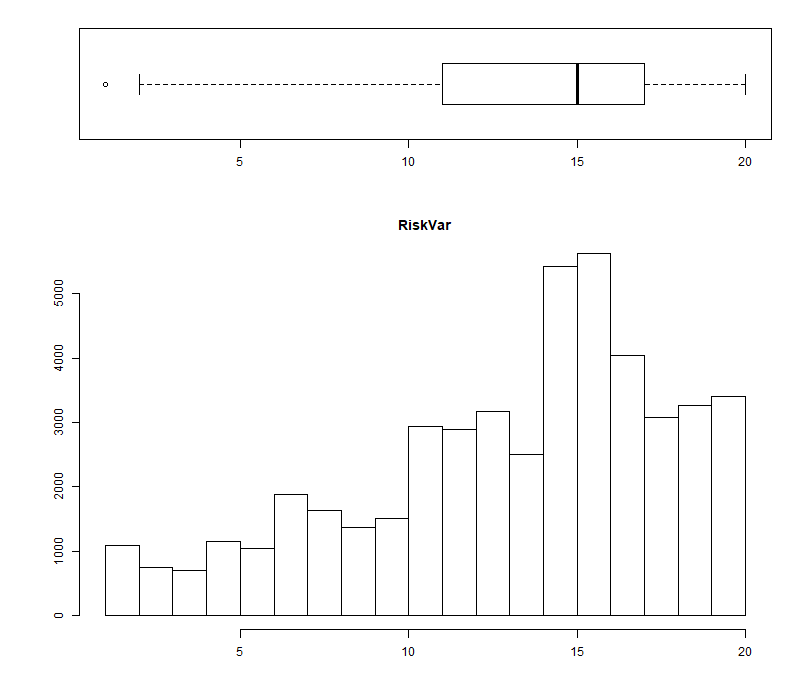

```{r setup, include=FALSE}
knitr::opts_chunk$set(echo=FALSE, message=FALSE, warning=FALSE)
```

```{r}
# Installation des packages utilisées dans ce projet

#install.packages(c("xts","sp","zoo"))
#install.packages("Hmisc")
#install.packages(c("FactoMineR", "factoextra"))
#install.packages("cowplot")

# Installation du package CASdatasets contenant les 2 jeux de données sur lesquels nous allons travaillés

#install.packages("CASdatasets", repos = "http://dutangc.free.fr/pub/RRepos/", type="source")

# Importation des librairies nécessaires aux datasets

library(zoo)
library(xts)
library(sp)
library(CASdatasets)

# Chargement des 2 jeux de données freMPL1 et freMPL2
data(freMPL1)
data(freMPL2)
```

# Présentation du projet

L’assurance est un contrat par lequel, moyennant le versement d’une prime dont le montant est fixé a priori (en début de période de couverture), l’assureur s’engage à indemniser l’assuré pendant toute la période de couverture (généralement un an). Cette prime doit refléter le risque associé au contrat. 
Pour chaque police d’assurance, la prime est fonction de variables dites de tarification permettant de segmenter la population en fonction de son risque. Il est usuel d’utiliser une approche fréquence/sévérité ou une approche indemnitaire pour modéliser le coût annuel d’une police d’assurance. Sur les données utilisées dans ce projet, nous utiliserons cette dernière approche car on ne dispose pas des montants individuels de sinistre.
Le but de ce projet est de proposer un tarificateur en se basant deux méthodes : les modèles linéaires généralisés (GLM) et les modèles additifs généralisés (GAM). Ces derniers sont une extension des GLM (proposé par McCullagh et Nelder, 1989) en considérant une approche non-paramétrique pour le prédicteur. 
Un second objectif sera, en plus de calculer une prime pure par police, de déterminer une commerciale intégrant une marge pour risque. Une approche par simulation sera réalisée pour juger de l’adéquation du chargement par rapport à la charge sinistre totale portefeuille.

# Exploration des jeux de données freMPL1 et freMPL2

Un peu à la manière du machine learning, les données contenues dans freMPL2 serviront de données d'entraînement de notre modèle et les données de freMPL1 serviront pour tester notre modèle final.

## Première visualisation des jeux de données 

```{r}
dim_freMPL1 <- dim(freMPL1)
dim_freMPL2 <- dim(freMPL2)
```

Les dimmensions du jeu de données **freMPL1** sont (`r dim_freMPL1`).
Ainsi, notre jeu contient `r dim_freMPL1[1]` données différentes, toutes définies par `r dim_freMPL1[2]` caractéristiques différentes. 

De même, les dimmensions du jeu de données **freMPL2** sont (`r dim_freMPL2`).
Ainsi, notre jeu contient `r dim_freMPL2[1]` données différentes, toutes définies par `r dim_freMPL2[2]` caractéristiques différentes. 

```{r, results='hide'}
colnames_freMPL1 <- colnames(freMPL1)
colnames_freMPL2 <- colnames(freMPL2) 
# Les noms des colonnes sont les mêmes. La seule différence entre nos 2 tableaux est l'inversion entre les colonnes RiskVar et ClaiAmount. 
# Regardons aussi les différents types d'objets figurant dans les colonnes :  
str(freMPL2)
# On constate qu'il y a de nombreux types de données : des données numériques, des données descriptives (ex : Il y a troix types de garages : "collective garage", "None" et "Private Garage")
```

Les noms des caractéristiques des jeux de données sont les mêmes. es différentes caractéristiques sont :

- **`r colnames_freMPL2[1]`** : il s'agit d'une donnée de type numérique qui correspond à la fréquence d'exposition aux risques d'un individu sur une année. Par exemple, si l'individu a été exposé 100 jours, le chiffre affiché est 0,27 (= 100/365,25).
- **`r colnames_freMPL2[2]`** : c'est un nombre entier de mois correspondant à l'âge de la licence de la personne concernée.
- **`r colnames_freMPL2[3]`** : cela correspond à la date de début d'exposition aux risques.
- **`r colnames_freMPL2[4]`** : c'est la date de fin d'exposition au risque. Si elle n'est pas renseigner, c'est que la personne est toujours exposée.
- **`r colnames_freMPL2[5]`** : Il correspond à l'âge du véhicule en année(s). Il est composé en 9 catégories distinctes : "0", "1", "2", "3", "4", "5", "6-7", "8-9" et "10+".
- **`r colnames_freMPL2[6]`** : c'est le sexe de l'individu.
- **`r colnames_freMPL2[7]`** : il s'agit du statut marital de la personne. Elle est soit célibataire ("Alone") soit autre chose ("Other").
- **`r colnames_freMPL2[8]`** : Cela correspond à la catégorie socioprofessionnelle de l'individu. Les valeurs, comprises entre "CSP1" et "CSP99", correspondent à la classification française (voir lien suivant : <https://fr.wikipedia.org/wiki/Professions_et_catégories_socioprofessionnelles_en_France>). 
- **`r colnames_freMPL2[9]`** : Cela correspond à l'utilisation du véhicule par le propriétaire. Il est soit privée ("Private"), soit professionnel ("Professional"), ...
- **`r colnames_freMPL2[10]`** : C'est l'âge du conducteur (en années). Pour rappel, en France, la conduite est possible à partir de 18 ans.
- **`r colnames_freMPL2[11]`** : il s'agit d'une valeur numérique spécifiant si oui ("1") ou non ("0") l'assurance comporte une limite kilométique.
- **`r colnames_freMPL2[12]`** : c'est un variable de type numérique, dont la valeur est comprise entre 50 et 350, précisant si la personne possède des bonus ou des malus. Si la valeur est inférieure à 100, l'individu a droit à des bonus. Sinon, la personne a des malus.
- **`r colnames_freMPL2[13]`** : il s'agit du type de modèle concerné par l'assurance de l'individu.
- **`r colnames_freMPL2[14]`** : c'est un indicateur correspondant au prix du véhicule. 
- **`r colnames_freMPL2[15]`** : cela correspond au type de moteur que possède le véhicule.
- **`r colnames_freMPL2[16]`** : cela correspond au type d'énergie consommé par le véhicule que possède le véhicule
- **`r colnames_freMPL2[17]`** : c'est la vitesse maximum que peut atteindre le véhicule. Les différentes catégories sont:"1-130 km/h", "130-140 km/h", "140-150 km/h", "150-160 km/h", "160-170 km/h", "170-180 km/h", "180-190 km/h", "190-200 km/h", "200-220 km/h", "220+ km/h".
- **`r colnames_freMPL2[18]`** : il s'agit de la classe du véhicule.
- **`r colnames_freMPL2[19]`** : Nombre compris entre 1 et 20 correspondant au risque inconnu probable.
- **`r colnames_freMPL2[20]`** : c'est le montant total de la garantie ) laquelle peut prétendre l'assuré.
- **`r colnames_freMPL2[21]`** : il s'agit du type de garage auquel se rend l'assuré.
- **`r colnames_freMPL2[22]`** : c'est un indicateur précisant si oui ou non l'assuré peut prétendre à une garantie.

Regardons maintenant les premiers éléments composant le jeu de données **freMPL1**:

```{r}
knitr::kable(t(head(freMPL1,3)))
```

et aussi les premiers éléments composants **freMPL2**: 
```{r}
knitr::kable(t(head(freMPL2,3)))
```

### Nettoyage de données

Remarquons qu'il serait intéressant de faire un peu de nettoyage de données avant d'effectuer quelconques travaux sur celles-ci.
Pour cela, nous allons créer une fonction qui servira à nettoyer les 2 dataframes.

Cette fonction (appelée nettoyage_dataframe) prend l'un des deux dataframes en paramètres et effectue les opérations suivantes :

- Suppression des données des individus assurés moins d'un jour (Exposure)
- Modification des données des individus ayant un ClaimAmount négatif
- Suppression de la colonne associée au sexe de la personne
- Réduction du nombre de catégories socioprofessionnels
- Traduction des données (VehBody, MariStat, VehUsage, VehEngine, VehEnergy, Garage)

```{r}
nettoyage_dataframe <- function(dt){
  
  # Suppression des données des individus assurés moins d'un jour (Exposure)
  dt <- subset(dt,dt$Exposure>1/365.25)
  
  # Modification des données des individus ayant un ClaimAmount négatif
  dt <- subset(dt,dt$ClaimAmount>=0)
  
  # Suppression de la colonne associée au sexe de la personne 
  dt <- dt[,-6]
  
  # Réduction du nombre de catégories socioprofessionnels
  levels(dt$SocioCateg) <- c(levels(dt$SocioCateg), "CSP4", "CSP6",
                                    "CSP9")
  for (i in 1:dim(dt)[1]){
    if (dt$SocioCateg[i]%in%c("CSP1","CSP16","CSP18","CSP19")){
      dt$SocioCateg[i]<-"CSP1"
      }
    if (dt$SocioCateg[i]%in%c("CSP2", "CSP20", "CSP21", "CSP22", "CSP23",
                                     "CSP25", "CSP26","CSP27", "CSP28")){
      dt$SocioCateg[i]<-"CSP2"
      }
    if (dt$SocioCateg[i]%in%c("CSP3", "CSP30", "CSP31", "CSP32", "CSP33",
                                     "CSP35", "CSP36","CSP37", "CSP38", "CSP39")){
      dt$SocioCateg[i]<-"CSP3"
      }
    if (dt$SocioCateg[i]%in%c("CSP40", "CSP41", "CSP42", "CSP43", "CSP46",
                                     "CSP47", "CSP48","CSP49")){
      dt$SocioCateg[i]<-"CSP4"
      }
    if (dt$SocioCateg[i]%in%c("CSP5", "CSP50", "CSP51", "CSP55", "CSP56", 
                                     "CSP57", "CSP59")){
      dt$SocioCateg[i]<-"CSP5"
      }
    if (dt$SocioCateg[i]%in%c("CSP6", "CSP60", "CSP61", "CSP62", "CSP63",
                                     "CSP65", "CSP66")){
      dt$SocioCateg[i]<-"CSP6"
      }
    if (dt$SocioCateg[i]%in%c("CSP7", "CSP70", "CSP73", "CSP74", "CSP77")){
      dt$SocioCateg[i]<-"CSP7"
      }
    if (dt$SocioCateg[i]%in%c("CSP9", "CSP91")){
      dt$SocioCateg[i]<-"CSP9"
      }
  }
  dt$SocioCateg <- droplevels(dt$SocioCateg)
  
  # Traduction des données (VehBody, MariStat, VehUsage, VehEngine, VehEnergy, Garage)
  for (i in 1:dim(dt)[2]){
    # Type de véhicules
    if (colnames(dt)[i]=="VehBody"){
      levels(dt$VehBody) <- c(levels(dt$VehBody), "autobus", "coupé",
                                     "autre microvan", "berline","SUV", "break",
                                     "camionnette")
      dt$VehBody[dt$VehBody == "bus"]<-"autobus"
      dt$VehBody[dt$VehBody == "coupe"]<-"coupé"
      dt$VehBody[dt$VehBody == "other microvan"]<-"autre microvan"
      dt$VehBody[dt$VehBody == "sedan"]<-"berline"
      dt$VehBody[dt$VehBody == "sport utility vehicle"]<-"SUV"
      dt$VehBody[dt$VehBody == "station wagon"]<-"break"
      dt$VehBody[dt$VehBody == "van"]<-"camionnette"
      dt$VehBody <- droplevels(dt$VehBody)
      }
    # Statut marital
    if (colnames(dt)[i]=="MariStat"){
      levels(dt$MariStat) <- c(levels(dt$MariStat), "célibataire", "autre")
      dt$MariStat[dt$MariStat == "Alone"]<-"célibataire"
      dt$MariStat[dt$MariStat == "Other"]<-"autre"
      dt$MariStat <- droplevels(dt$MariStat)
      }
    # Utilisation du véhicule
    if (colnames(dt)[i]=="VehUsage"){
      levels(dt$VehUsage) <- c(levels(dt$VehUsage), "privée", 
                                      "privée et trajet vers bureau", "professionnel", 
                                      "trajet professionnel" )
      dt$VehUsage[dt$VehUsage == "Private"]<-"privée"
      dt$VehUsage[dt$VehUsage == "Private+trip to office"]<-
      "privée et trajet vers bureau"
      dt$VehUsage[dt$VehUsage == "Professional"]<-"professionnel"
      dt$VehUsage[dt$VehUsage == "Professional run"]<-
      "trajet professionnel"
      dt$VehUsage <- droplevels(dt$VehUsage)
      }
    # Moteur du véhicule
    if (colnames(dt)[i]=="VehEngine"){
      levels(dt$VehEngine) <- c(levels(dt$VehEngine), 
                                       "injection directe surpuissante",
                                       "électrique", "injection surpuissante")
      dt$VehEngine[dt$VehEngine == "direct injection overpowered"]<-
      "injection directe surpuissante"
      dt$VehEngine[dt$VehEngine == "electric"]<-"électrique"
      dt$VehEngine[dt$VehEngine == "injection overpowered"]<-
      "injection surpuissante"
      dt$VehEngine <- droplevels(dt$VehEngine)
      }
    # Energie utilisée par le véhicule
    if (colnames(dt)[i]=="VehEnergy"){
      levels(dt$VehEnergy) <- c(levels(dt$VehEnergy), "électrique", "essence")
      dt$VehEnergy[dt$VehEnergy == "regular"]<-"essence"
      dt$VehEnergy[dt$VehEnergy == "eletric"]<-"électrique"
      dt$VehEnergy <- droplevels(dt$VehEnergy)
      }
    # Garage
    if (colnames(dt)[i]=="Garage"){
      levels(dt$Garage) <- c(levels(dt$Garage), "aucun", "garage indépendant",
                                    "concessionnaire")
      dt$Garage[dt$Garage == "None"]<-"aucun"
      dt$Garage[dt$Garage == "Private garage"]<-"garage indépendant"
      dt$Garage[dt$Garage == "Collective garage"]<-"concessionnaire"
      dt$Garage <- droplevels(dt$Garage)
    }
  }
  return (dt)
}
```

```{r}
# nettoyage de nos 2 dataframes : 

freMPL2 <- nettoyage_dataframe(freMPL2)
freMPL1 <- nettoyage_dataframe(freMPL1)
```

### Statistiques descriptives 

Regardons maintenant plus précisement les valeurs particulières de ces colonnes (valeurs minimum et maximum, moyenne, médiane,quantiles, ...)

```{r, eval = FALSE}
summary(freMPL2)
```
On remarquera qu'il existe des données manquantes dans la colonne RecEnd, ce qui signifie que les individus concernés sont toujours assurés. 

On peut aussi utiliser la méthode describe du package Hmisc pour avoir un aperçu de la dispersion des données.

```{r, eval = FALSE}
library("Hmisc")
describe(freMPL2)
```
Mais cela ne vaut pas une représentation graphique.

### Représentations graphiques des données

```{r}
# On met les colonnes dans le même ordre

freMPL1 <- freMPL1[,c(1:17,19,18,20:21)]
```


```{r}
library("ggplot2")
library("dplyr") 
library("cowplot")

representation_graphique <- function(dataframe, col){
  indice_col <-  which(colnames(dataframe) == col)
  if(indice_col %in% c(1,2,9,11,18,19)){
    par(fig=c(0.1,1,0.1,0.7), mar = c(0,0,2,2))
    hist(dataframe[,indice_col],
      main = paste(col))
    par(fig=c(0.1,1,0.8,1), mar = c(0,0,2,2), new = TRUE)
    boxplot(dataframe[,indice_col], data = dataframe, horizontal = TRUE)
  }else{
    if(indice_col %in% c(5)){
      dt <- data.frame(
        class = c("0","1","2","3","4","5","6-7","8-9","10+"),
        n = as.data.frame(table(dataframe[,indice_col]))[,2],
        prop = as.data.frame(round(prop.table(table(dataframe[,indice_col])),2))[,2]
        )
      dt <- dt %>%
        arrange(desc(class)) %>%
        mutate(lab.ypos = cumsum(prop) - 0.5*prop)
      barre <- ggplot(dt, aes(x = class, y = n, fill = class)) +
        geom_bar(width = 1, stat = "identity", color = "white")+
        theme_minimal()
      camembert <- ggplot(dt, aes(x = "", y = prop, fill = class)) +
        geom_bar(width = 1, stat = "identity", color = "white") +
        coord_polar("y", start = 0)+
        geom_text(aes(y = lab.ypos, label = prop), color = "white")+
        theme_void()
      plot_grid(barre, camembert, ncol = 2, nrow = 1)
    }else{
      if(indice_col %in% c(10,21)){
        dt <- data.frame(
          class = c("0","1"),
          n = as.data.frame(table(dataframe[,indice_col]))[,2],
          prop = as.data.frame(round(prop.table(table(dataframe[,indice_col])),2))[,2]
          )
        dt <- dt %>%
          arrange(desc(class)) %>%
          mutate(lab.ypos = cumsum(prop) - 0.5*prop)
        barre <- ggplot(dt, aes(x = class, y = n, fill = class)) +
          geom_bar(width = 1, stat = "identity", color = "white")+
          theme_minimal()
        camembert <- ggplot(dt, aes(x = "", y = prop, fill = class)) +
          geom_bar(width = 1, stat = "identity", color = "white") +
          coord_polar("y", start = 0)+
          geom_text(aes(y = lab.ypos, label = prop), color = "white")+
          theme_void()
        plot_grid(barre, camembert, ncol = 2, nrow = 1)
      }else{
        dt <- data.frame(
          class = levels(dataframe[,indice_col]),
          n = as.data.frame(table(dataframe[,indice_col]))[,2],
          prop = as.data.frame(round(prop.table(table(dataframe[,indice_col])),2))[,2]
          )
        dt <- dt %>%
          arrange(desc(class)) %>%
          mutate(lab.ypos = cumsum(prop) - 0.5*prop)
        barre <- ggplot(dt, aes(x = class, y = n, fill = class)) +
          geom_bar(width = 1, stat = "identity", color = "white")+
          theme_minimal()
        camembert <- ggplot(dt, aes(x = "", y = prop, fill = class)) +
          geom_bar(width = 1, stat = "identity", color = "white") +
          coord_polar("y", start = 0)+
          geom_text(aes(y = lab.ypos, label = prop), color = "white")+
          theme_void()
        plot_grid(barre, camembert, ncol = 2, nrow = 1)
      }
    }
  }
}
```

```{r, results = 'hide'}
colnames(freMPL1)
png(file = "graphique/Exposure1.png", width = 800, height = 700)
representation_graphique(freMPL1,colnames(freMPL1)[1])
dev.off()
png(file = "graphique/LicAge1.png", width = 800, height = 700)
representation_graphique(freMPL1,colnames(freMPL1)[2])
dev.off()
png(file = "graphique/VehAge1.png", width = 800, height = 700)
representation_graphique(freMPL1,colnames(freMPL1)[5])
dev.off()
png(file = "graphique/MariStat1.png", width = 800, height = 700)
representation_graphique(freMPL1,colnames(freMPL1)[6])
dev.off()
png(file = "graphique/SocioCateg1.png", width = 800, height = 700)
representation_graphique(freMPL1,colnames(freMPL1)[7])
dev.off()
png(file = "graphique/VehUsage1.png", width = 800, height = 700)
representation_graphique(freMPL1,colnames(freMPL1)[8])
dev.off()
png(file = "graphique/DrivAge1.png", width = 800, height = 700)
representation_graphique(freMPL1,colnames(freMPL1)[9])
dev.off()
png(file = "graphique/HasKmLimit1.png", width = 800, height = 700)
representation_graphique(freMPL1,colnames(freMPL1)[10])
dev.off()
png(file = "graphique/BonusMalus1.png", width = 800, height = 700)
representation_graphique(freMPL1,colnames(freMPL1)[11])
dev.off()
png(file = "graphique/VehBody1.png", width = 800, height = 700)
representation_graphique(freMPL1,colnames(freMPL1)[12])
dev.off()
png(file = "graphique/VehPrice1.png", width = 800, height = 700)
representation_graphique(freMPL1,colnames(freMPL1)[13])
dev.off()
png(file = "graphique/VehEngine1.png", width = 800, height = 700)
representation_graphique(freMPL1,colnames(freMPL1)[14])
dev.off()
png(file = "graphique/VehEnergy1.png", width = 800, height = 700)
representation_graphique(freMPL1,colnames(freMPL1)[15])
dev.off()
png(file = "graphique/VehMaxSpeed1.png", width = 800, height = 700)
representation_graphique(freMPL1,colnames(freMPL1)[16])
dev.off()
png(file = "graphique/VehClass1.png", width = 800, height = 700)
representation_graphique(freMPL1,colnames(freMPL1)[17])
dev.off()
png(file = "graphique/RiskVar1.png", width = 800, height = 700)
representation_graphique(freMPL1,colnames(freMPL1)[18])
dev.off()
png(file = "graphique/ClaimAmount1.png", width = 800, height = 700)
representation_graphique(freMPL1,colnames(freMPL1)[19])
dev.off()
png(file = "graphique/Garage1.png", width = 800, height = 700)
representation_graphique(freMPL1,colnames(freMPL1)[20])
dev.off()
png(file = "graphique/ClaimInd1.png", width = 800, height = 700)
representation_graphique(freMPL1,colnames(freMPL1)[21])
dev.off()

png(file = "graphique/Exposure2.png", width = 800, height = 700)
representation_graphique(freMPL2,colnames(freMPL2)[1])
dev.off()
png(file = "graphique/LicAge2.png", width = 800, height = 700)
representation_graphique(freMPL2,colnames(freMPL2)[2])
dev.off()
png(file = "graphique/VehAge2.png", width = 800, height = 700)
representation_graphique(freMPL2,colnames(freMPL2)[5])
dev.off()
png(file = "graphique/MariStat2.png", width = 800, height = 700)
representation_graphique(freMPL2,colnames(freMPL2)[6])
dev.off()
png(file = "graphique/SocioCateg2.png", width = 800, height = 700)
representation_graphique(freMPL2,colnames(freMPL2)[7])
dev.off()
png(file = "graphique/VehUsage2.png", width = 800, height = 700)
representation_graphique(freMPL2,colnames(freMPL2)[8])
dev.off()
png(file = "graphique/DrivAge2.png", width = 800, height = 700)
representation_graphique(freMPL2,colnames(freMPL2)[9])
dev.off()
png(file = "graphique/HasKmLimit2.png", width = 800, height = 700)
representation_graphique(freMPL2,colnames(freMPL2)[10])
dev.off()
png(file = "graphique/BonusMalus2.png", width = 800, height = 700)
representation_graphique(freMPL2,colnames(freMPL2)[11])
dev.off()
png(file = "graphique/VehBody2.png", width = 800, height = 700)
representation_graphique(freMPL2,colnames(freMPL2)[12])
dev.off()
png(file = "graphique/VehPrice2.png", width = 800, height = 700)
representation_graphique(freMPL2,colnames(freMPL2)[13])
dev.off()
png(file = "graphique/VehEngine2.png", width = 800, height = 700)
representation_graphique(freMPL2,colnames(freMPL2)[14])
dev.off()
png(file = "graphique/VehEnergy2.png", width = 800, height = 700)
representation_graphique(freMPL2,colnames(freMPL2)[15])
dev.off()
png(file = "graphique/VehMaxSpeed2.png", width = 800, height = 700)
representation_graphique(freMPL2,colnames(freMPL2)[16])
dev.off()
png(file = "graphique/VehClass2.png", width = 800, height = 700)
representation_graphique(freMPL2,colnames(freMPL2)[17])
dev.off()
png(file = "graphique/RiskVar2.png", width = 800, height = 700)
representation_graphique(freMPL2,colnames(freMPL2)[18])
dev.off()
png(file = "graphique/ClaimAmount2.png", width = 800, height = 700)
representation_graphique(freMPL2,colnames(freMPL2)[19])
dev.off()
png(file = "graphique/Garage2.png", width = 800, height = 700)
representation_graphique(freMPL2,colnames(freMPL2)[20])
dev.off()
png(file = "graphique/ClaimInd2.png", width = 800, height = 700)
representation_graphique(freMPL1,colnames(freMPL2)[21])
dev.off()
```


### ACP 

L'ACP permet d’analyser et de visualiser un jeu de données contenant des individus décrits par plusieurs variables quantitatives.
C’est une méthode statistique qui permet d’explorer des données dites multivariées (données avec plusieurs variables). Chaque variable pourrait être considérée comme une dimension différente.
L’analyse en composantes principales est utilisée pour extraire et de visualiser les informations importantes contenues dans une table de données multivariées. L’ACP synthétise cette information en seulement quelques nouvelles variables appelées composantes principales. Ces nouvelles variables correspondent à une combinaison linéaire des variables originels. Le nombre de composantes principales est inférieur ou égal au nombre de variables d’origine.

#### Exécution sur nos données freMPL2

Attention, les valeurs doivent être numériques.

On va donc convertir nos valeurs en numérique :
```{r}
freMPL2$LicAge <- as.numeric(freMPL2$LicAge)
freMPL2$DrivAge <- as.numeric(freMPL2$DrivAge)
freMPL2$HasKmLimit <- as.numeric(freMPL2$HasKmLimit)
freMPL2$BonusMalus <- as.numeric(freMPL2$BonusMalus)
freMPL2$RiskVar <- as.numeric(freMPL2$RiskVar)
freMPL2$ClaimAmount <- as.numeric(freMPL2$ClaimAmount)
freMPL2$ClaimInd <- as.numeric(freMPL2$ClaimInd)
```

Certaines colonnes sont catégorisés et pourraient nous être utiles pour éxécuter notre ACP.
Il n'est cependant pas judicieux d'appliquer une conversion numérique à ces colonnes puisqu'on leur attribue une valeur arbitraire nous faisant penser à une classification des différents facteurs possibles. Pour éviter cela, on va donc utiliser la méthode model.matrix() qui crée une matrice binaire spécifiant à quel facteur correspond une ligne du dataframe.

```{r}
#head(model.matrix(~VehAge, data = freMPL2))
#head(model.matrix(~MariStat, data = freMPL2))
```


```{r}
library("FactoMineR")
library("factoextra") # Pour la visualisation 
```

```{r}
freMPL2.active <- freMPL2[,c(1:2,9:11, 18:19,21)]
freMPL2.pca <- PCA(freMPL2.active, graph = FALSE)
```

Affichage du résultat : 

```{r}
get_eigenvalue(freMPL2.pca)
fviz_eig(freMPL2.pca)
```

utilisation de cos2 pour juger de la qualité de la représentation :

```{r}
fviz_pca_var(freMPL2.pca, col.var = "cos2",
             gradient.cols = c("#00AFBB", "#E7B800", "#FC4E07"),
             repel = TRUE # Évite le chevauchement de texte
             )
```

contribution des colonnes aux dimensions : 

```{r}
fviz_pca_var(freMPL2.pca, col.var = "contrib",
             gradient.cols = c("#00AFBB", "#E7B800", "#FC4E07")
             )
```
Description des dimensions

Dans les sections précédentes, nous avons décrit comment mettre en évidence les variables en fonction de leurs contributions aux composantes principales.

Notez également que la fonction dimdesc() [dans FactoMineR], pour dimension description (en anglais), peut être utilisée pour identifier les variables les plus significativement associées avec une composante principale donnée . Elle peut être utilisée comme suit:

```{r, eval = FALSE}
freMPL2.desc <- dimdesc(freMPL2.pca, axes = c(1,2), proba = 0.05)
head(freMPL2.desc)
```

### AFC 

L’ analyse factorielle des correspondances est une extension de l’analyse en composantes principales pour analyser l’association entre deux variables qualitatives (ou catégorielles).
L’AFC permet de résumer et de visualiser l’information contenue dans le tableau de contingence formé par les deux variables catégorielles. Le tableau de contingence contient les fréquences formées par les deux variables.

```{r}
library ("FactoMineR")
freMPL2.ca <- CA (freMPL2.active)
```

```{r}
get_eigenvalue(freMPL2.ca)
fviz_screeplot (freMPL2.ca, addlabels = TRUE)
```

```{r}
fviz_ca_col (freMPL2.ca, col.col = "cos2",
             gradient.cols = c("#00AFBB", "#E7B800", "#FC4E07"),
             repel = TRUE)
fviz_cos2 (freMPL2.ca, choice = "col", axes = 1:2)
```

```{r}
res.desc <- dimdesc(freMPL2.ca, axes = c(1, 2))
res.desc[[1]]$col
```

# GLM 

Les lois les plus utilisées sont :
- Poisson ou binomiale négative pour les fréquences des sinistres
- Gamma et Inverse gauss pour la sévérité des sinistres

## Fréquence des sinistres

### Présentation des lois utilisables

#### la loi de Poisson

```{r}
x_dpois <- seq(0, 30, by = 1) 
par(mfcol = c(1,3))
y_dpois1 <- dpois(x_dpois, lambda = 5)
y_dpois2 <- dpois(x_dpois, lambda = 10) 
y_dpois3 <- dpois(x_dpois, lambda = 15) 
plot(y_dpois1, type = "b", col = "blue", main =" lambda = 5", xlab = "x", ylab = "p(x)", ylim = c(0,0.2))
plot(y_dpois2, type = "b", col = "red", main =" lambda = 10", xlab = "x", ylab = "p(x)", ylim = c(0,0.2))
plot(y_dpois3, type = "b", col = "green", main =" lambda = 15", xlab = "x", ylab = "p(x)", ylim = c(0,0.2))
```

#### la loi binomiale négative

```{r}
x_dnbinom <- seq(0, 30, by = 1)
y_dnbinom1 <- dnbinom(x_dnbinom, size=5, prob=.5)
y_dnbinom2 <- dnbinom(x_dnbinom, size=10, prob=.5)
y_dnbinom3 <- dnbinom(x_dnbinom, size=15, prob=.5)
y_dnbinom4 <- dnbinom(x_dnbinom, size=10, prob=.25)
y_dnbinom5 <- dnbinom(x_dnbinom, size=10, prob=.75)

plot(x_dnbinom, y_dnbinom1, type = "b", xlab = "x", ylab = "p(x)", col = "red", ylim = c(0,0.2), main ="Quelques exemples de loi binomiale négative") 
lines(x_dnbinom, y_dnbinom2, type = "b", col = "orange", ylim = c(0,0.2))
lines(x_dnbinom, y_dnbinom3, type = "b", col = "yellow", ylim = c(0,0.2))
lines(x_dnbinom, y_dnbinom4, type = "b", col = "blue", ylim = c(0,0.2))
lines(x_dnbinom, y_dnbinom5, type = "b", col = "dark green", ylim = c(0,0.2))

legend("topright", legend = c("n = 5 et p = 0,5", "n = 10 et p = 0,5", "n = 15 et p = 0,5", "n = 10 et p = 0,25", "n = 10 et p = 0,75"),lty = 1, col = c("red", "orange", "yellow", "blue", "dark green"))
```


comparaison binomiale et binomiale négative : 

```{r}
y_dbinom <- dbinom(x_dnbinom, size=15, prob=.5)

plot(x_dnbinom, y_dnbinom3, type = "b", xlab = "x", ylab = "p(x)", col = "red", ylim = c(0,0.2), main = "Comparaison entre loi binomiale et loi binomiale négative")
lines(x_dnbinom, y_dbinom, type = "b", col = "orange", ylim = c(0,0.2))
legend("topright",title ="Pour n = 15 et p = 0.5", c("binomiale", "binomiale négative"),lty = 1, col = c("red", "orange"))

```


Test du modèle GLM avec la loi de Poisson : 

```{r, echo = TRUE}
#calibration d’une loi de Poisson
glm1 <- glm(ClaimInd~DrivAge+VehAge+VehUsage+BonusMalus+VehBody+VehMaxSpeed+ClaimAmount+offset(log(Exposure)), family=poisson("log"), data=freMPL2)
summary(glm1)
#glm1$aic
#glm1$null.deviance
#glm1$deviance
#glm1$iter
predict1 <- predict(glm1, freMPL2, type = 'response')
recap1 <- data.frame(ClaimInd = freMPL2$ClaimInd,
                     Predict_ClaimInd = predict1,
                     difference = abs(freMPL2$ClaimInd- predict1))
head(recap1,10)
# recap1[recap1$difference<0.5 & recap1$ClaimInd == 1,]
 # Ce modèle ne fonctionne pas pour prédire les ClaimInd égaux à 1


test1 <- data.frame(
  DrivAge = c(18:103),
  nb_individu = rep(0,times = 103-18+1),
  total_obs = rep(0,times = 103-18+1),
  total_pred = rep(0,times = 103-18+1),
  frequence_obs = rep(0,times = 103-18+1),
  frequence_pred = rep(0,times = 103-18+1)
)

for (i in 1:dim(freMPL2)[1]){
  age <- freMPL2$DrivAge[i]
  test1[test1$DrivAge==age,"nb_individu"] <- test1[test1$DrivAge==age,"nb_individu"]+1
  test1[test1$DrivAge==age,"total_obs"] <-
    test1[test1$DrivAge==age,"total_obs"]+(freMPL2$ClaimInd[i]/freMPL2$Exposure[i])
  test1[test1$DrivAge==age,"total_pred"] <-
    test1[test1$DrivAge==age,"total_pred"]+(predict1[i]/freMPL2$Exposure[i])
}


for (j in 1:dim(test1)[1]){
  if (test1$nb_individu[j]!=0){
    test1[j,"frequence_obs"] <- test1[j,"total_obs"]/ test1[j,"nb_individu"]
    test1[j,"frequence_pred"] <- test1[j,"total_pred"]/ test1[j,"nb_individu"] 
  }
}

plot(test1$DrivAge,test1$frequence_obs, type = "b")
lines(test1$DrivAge,test1$frequence_pred, type = "b", col = "red")
```

```{r}
glm1
```


Quasipoisson: 


Dispersion????


```{r}
#calibration d’une loi de quasipoisson
glm2 <- glm(ClaimInd~DrivAge+VehAge+VehUsage+BonusMalus+VehBody+VehMaxSpeed+ClaimAmount+offset(log(Exposure)), family=quasipoisson("log"), data=freMPL2)
summary(glm2)
#glm2$aic
#glm2$null.deviance
#glm2$deviance
#glm2$iter
predict2 <- predict(glm2, freMPL2, type = 'response')
recap2 <- data.frame(ClaimInd = freMPL2$ClaimInd,
                     Predict_ClaimInd = predict2,
                     difference = abs(freMPL2$ClaimInd- predict2))
head(recap2,10)
#recap2[recap2$difference<0.5 & recap2$ClaimInd == 1,]
 # Ce modèle ne fonctionne pas pour prédire les ClaimInd égaux à 1


test2 <- data.frame(
  DrivAge = c(18:103),
  nb_individu = rep(0,times = 103-18+1),
  total_obs = rep(0,times = 103-18+1),
  total_pred = rep(0,times = 103-18+1),
  frequence_obs = rep(0,times = 103-18+1),
  frequence_pred = rep(0,times = 103-18+1)
)

for (i in 1:dim(freMPL2)[1]){
  age <- freMPL2$DrivAge[i]
  test2[test2$DrivAge==age,"nb_individu"] <- test2[test2$DrivAge==age,"nb_individu"]+1
  test2[test2$DrivAge==age,"total_obs"] <-
    test2[test2$DrivAge==age,"total_obs"]+(freMPL2$ClaimInd[i]/freMPL2$Exposure[i])
  test2[test2$DrivAge==age,"total_pred"] <-
    test2[test2$DrivAge==age,"total_pred"]+(predict2[i]/freMPL2$Exposure[i])
}


for (j in 1:dim(test1)[1]){
  if (test2$nb_individu[j]!=0){
    test2[j,"frequence_obs"] <- test2[j,"total_obs"]/ test2[j,"nb_individu"]
    test2[j,"frequence_pred"] <- test2[j,"total_pred"]/ test2[j,"nb_individu"] 
  }
}

plot(test2$DrivAge,test2$frequence_obs, type = "b")
lines(test2$DrivAge,test2$frequence_pred, type = "b", col = "red")
```

```{r}
# neg bin
library(MASS)
phi <- 1

glm3 <- glm(ClaimInd~DrivAge+VehAge+VehUsage+BonusMalus+VehBody+VehMaxSpeed+ClaimAmount+offset(log(Exposure)), family=negative.binomial(phi), data=freMPL2)
summary(glm3)
predict3 <- predict(glm3, freMPL2, type = 'response')
recap3 <- data.frame(ClaimInd = freMPL2$ClaimInd,
                     Predict_ClaimInd = predict3,
                     difference = abs(freMPL2$ClaimInd- predict3))
head(recap3,10)
recap3[recap3$difference<0.1 & recap3$ClaimInd == 1,]
 # Ce modèle ne fonctionne pas pour prédire les ClaimInd égaux à 1


test3 <- data.frame(
  DrivAge = c(18:103),
  nb_individu = rep(0,times = 103-18+1),
  total_obs = rep(0,times = 103-18+1),
  total_pred = rep(0,times = 103-18+1),
  frequence_obs = rep(0,times = 103-18+1),
  frequence_pred = rep(0,times = 103-18+1)
)

for (i in 1:dim(freMPL2)[1]){
  age <- freMPL2$DrivAge[i]
  test3[test3$DrivAge==age,"nb_individu"] <- test3[test3$DrivAge==age,"nb_individu"]+1
  test3[test3$DrivAge==age,"total_obs"] <-
    test3[test3$DrivAge==age,"total_obs"]+(freMPL2$ClaimInd[i]/freMPL2$Exposure[i])
  test3[test3$DrivAge==age,"total_pred"] <-
    test3[test3$DrivAge==age,"total_pred"]+(predict3[i]/freMPL2$Exposure[i])
}


for (j in 1:dim(test1)[1]){
  if (test3$nb_individu[j]!=0){
    test3[j,"frequence_obs"] <- test3[j,"total_obs"]/ test3[j,"nb_individu"]
    test3[j,"frequence_pred"] <- test3[j,"total_pred"]/ test3[j,"nb_individu"] 
  }
}

plot(test3$DrivAge,test3$frequence_obs, type = "b")
lines(test3$DrivAge,test3$frequence_pred, type = "b", col = "red")
```
#  *Ce modèle binomiale négative semble intéressant. Reste à savoir comment déterminer le coefficient phi. Et si nos paramètres sont les bons.*


Le résumé de notre modèle révèle des informations intéressantes. La performance d'une régression logistique est évaluée avec des métriques clés spécifiques :
- AIC (Critère d'information d'Akaike): Il mesure l'ajustement lorsqu'une pénalité est appliquée au nombre de paramètres. Des valeurs AIC plus petites indiquent que le modèle est plus proche de la vérité. Ici, il est de 213416.2 ce qui n'est pas bon du tout. 
- Null deviance : Il s'agit de la déviance du modèle nul, c'est-à-dire qu'il 'est caractérisé par aucun facteur. Elle est de 297600 sur 25387 degrés de liberté.
- Residual deviance : Il s'agit de la déviance du modèle avec toutes les variables. Elle est de 102549 sur 25304 degrés de liberté.
- Number of Fisher Scoring iterations : Il s'agit du nombre d'itérations avant la convergence

## Sévérité des sinistres

### Présentation des lois utilisables

#### loi de gamma (ou d'Euler)

```{r}
x_dgamma<- seq(0, 20, by = 0.01) 
y_dgamma1 <- dgamma(x_dgamma, shape = 1, scale = 2)
y_dgamma2 <- dgamma(x_dgamma, shape = 2, scale = 2)
y_dgamma3 <- dgamma(x_dgamma, shape = 3, scale = 2)
y_dgamma4 <- dgamma(x_dgamma, shape = 5, scale = 1)
y_dgamma5 <- dgamma(x_dgamma, shape = 9, scale = 0.5)
y_dgamma6 <- dgamma(x_dgamma, shape = 7.5, scale = 1)
y_dgamma7 <- dgamma(x_dgamma, shape = 0.5, scale = 1)
# shape correspond à alpha et scale correspond à beta 

plot(x_dgamma, y_dgamma1, type = "l",col = "red",main = "distribution de loi gamma", xlab = " ", ylab = " ")
lines(x_dgamma, y_dgamma2, col = "orange")
lines(x_dgamma, y_dgamma3, col = "yellow")
lines(x_dgamma, y_dgamma4, col = "green")
lines(x_dgamma, y_dgamma5, col = "black")
lines(x_dgamma, y_dgamma6, col = "blue")
lines(x_dgamma, y_dgamma7, col = "purple")
legend("topright", legend = c("alpha = 1 et beta = 2", "alpha = 2 et beta = 2", "alpha = 3 et beta = 2","alpha = 5 et beta = 1", "alpha = 9 et beta = 0.5", "alpha = 7.5 et beta = 1", "alpha = 0.5 et beta = 1"),lty = 1, col = c("red", "orange", "yellow", "green", "black", "blue", "purple"))
```

### Inverse gauss

```{r}
#install.packages("statmod")
library("statmod")
x_dinvgauss <- seq(0, 5, by = 0.01) 
y_dinvgauss1 <- dinvgauss(x_dinvgauss, 1, 1) 
y_dinvgauss2 <- dinvgauss(x_dinvgauss, 1, 0.2) 
y_dinvgauss3 <- dinvgauss(x_dinvgauss, 1, 3) 
y_dinvgauss4 <- dinvgauss(x_dinvgauss, 3, 1) 
plot(x_dinvgauss, y_dinvgauss1, type = "l",col = "green",main = "distribution de loi inverse gaussienne", xlab = " ", ylab = " ")
lines(x_dinvgauss, y_dinvgauss2, col = "red")
lines(x_dinvgauss, y_dinvgauss3, col = "blue")
lines(x_dinvgauss, y_dinvgauss4, col = "orange")
legend("topright", legend = c("mu = 1 et lambda = 1", "mu = 1 et lambda = 0.2", "mu = 1 et lambda = 3","mu = 3 et lambda = 1"),lty = 1, col = c("green", "red", "blue", "orange"))
```

```{r}
glm4 <- glm(ClaimAmount~DrivAge+VehAge+VehUsage+BonusMalus+VehBody+VehMaxSpeed+ClaimAmount+offset(log(Exposure)), family=poisson("log"), data=freMPL2)
summary(glm4)
predict4 <- predict(glm4, freMPL2, type = 'response')
recap4 <- data.frame(ClaimAmount = freMPL2$ClaimAmount,
                     Predict_ClaimAmount = predict4,
                     difference = abs(freMPL2$ClaimAmount- predict4))
head(recap4,10)
```


### Calcul de la prime pure

Soit X le coût monétaire au risque

Selon le modèle général, X = SOMME de 1 à N des Bk

où N correspond au nombre de sinistres
et Bk correspond au montant de sinistres

Autrement dit, N représente la fréquence (variable discrète) et Bk la sévérité (variable continue positive)

En admettant que la fréquence n'a pas d'influence sur la sévérité et que les montants des sinistres ont le même comportement aléatoire, on a : E(X) = E(N).E(B)   (prime pure). 


Comment calculer E(N)? Comment calculer E(B)?


# Bibliographie


# Annexes

## Affichage de l'implementation de la fonction nettoyage_dataframe : 

```
nettoyage_dataframe <- function(dt){
  
  # Suppression des données des individus assurés moins d'un jour (Exposure)
  dt <- subset(dt,dt$Exposure>1/365.25)
  
  # Modification des données des individus ayant un ClaimAmount négatif
  dt <- subset(dt,dt$ClaimAmount>=0)
  
  # Suppression de la colonne associée au sexe de la personne et de ClaimInd
  dt <- dt[,-6]
  dt <- dt[,-21]
  
  # Réduction du nombre de catégories socioprofessionnels
  levels(dt$SocioCateg) <- c(levels(dt$SocioCateg), "CSP4", "CSP6",
                                    "CSP9")
  for (i in 1:dim(dt)[1]){
    if (dt$SocioCateg[i]%in%c("CSP1","CSP16","CSP18","CSP19")){
      dt$SocioCateg[i]<-"CSP1"
      }
    if (dt$SocioCateg[i]%in%c("CSP2", "CSP20", "CSP21", "CSP22", "CSP23",
                                     "CSP25", "CSP26","CSP27", "CSP28")){
      dt$SocioCateg[i]<-"CSP2"
      }
    if (dt$SocioCateg[i]%in%c("CSP3", "CSP30", "CSP31", "CSP32", "CSP33",
                                     "CSP35", "CSP36","CSP37", "CSP38", "CSP39")){
      dt$SocioCateg[i]<-"CSP3"
      }
    if (dt$SocioCateg[i]%in%c("CSP40", "CSP41", "CSP42", "CSP43", "CSP46",
                                     "CSP47", "CSP48","CSP49")){
      dt$SocioCateg[i]<-"CSP4"
      }
    if (dt$SocioCateg[i]%in%c("CSP5", "CSP50", "CSP51", "CSP55", "CSP56", 
                                     "CSP57", "CSP59")){
      dt$SocioCateg[i]<-"CSP5"
      }
    if (dt$SocioCateg[i]%in%c("CSP6", "CSP60", "CSP61", "CSP62", "CSP63",
                                     "CSP65", "CSP66")){
      dt$SocioCateg[i]<-"CSP6"
      }
    if (dt$SocioCateg[i]%in%c("CSP7", "CSP70", "CSP73", "CSP74", "CSP77")){
      dt$SocioCateg[i]<-"CSP7"
      }
    if (dt$SocioCateg[i]%in%c("CSP9", "CSP91")){
      dt$SocioCateg[i]<-"CSP9"
      }
  }
  dt$SocioCateg <- droplevels(dt$SocioCateg)
  
  # Traduction des données (VehBody, MariStat, VehUsage, VehEngine, VehEnergy, Garage)
  for (i in 1:dim(dt)[2]){
    # Type de véhicules
    if (colnames(dt)[i]=="VehBody"){
      levels(dt$VehBody) <- c(levels(dt$VehBody), "autobus", "coupé",
                                     "autre microvan", "berline","SUV", "break",
                                     "camionnette")
      dt$VehBody[dt$VehBody == "bus"]<-"autobus"
      dt$VehBody[dt$VehBody == "coupe"]<-"coupé"
      dt$VehBody[dt$VehBody == "other microvan"]<-"autre microvan"
      dt$VehBody[dt$VehBody == "sedan"]<-"berline"
      dt$VehBody[dt$VehBody == "sport utility vehicle"]<-"SUV"
      dt$VehBody[dt$VehBody == "station wagon"]<-"break"
      dt$VehBody[dt$VehBody == "van"]<-"camionnette"
      dt$VehBody <- droplevels(dt$VehBody)
      }
    # Statut marital
    if (colnames(dt)[i]=="MariStat"){
      levels(dt$MariStat) <- c(levels(dt$MariStat), "célibataire", "autre")
      dt$MariStat[dt$MariStat == "Alone"]<-"célibataire"
      dt$MariStat[dt$MariStat == "Other"]<-"autre"
      dt$MariStat <- droplevels(dt$MariStat)
      }
    # Utilisation du véhicule
    if (colnames(dt)[i]=="VehUsage"){
      levels(dt$VehUsage) <- c(levels(dt$VehUsage), "privée", 
                                      "privée et trajet vers bureau", "professionnel", 
                                      "trajet professionnel" )
      dt$VehUsage[dt$VehUsage == "Private"]<-"privée"
      dt$VehUsage[dt$VehUsage == "Private+trip to office"]<-
      "privée et trajet vers bureau"
      dt$VehUsage[dt$VehUsage == "Professional"]<-"professionnel"
      dt$VehUsage[dt$VehUsage == "Professional run"]<-
      "trajet professionnel"
      dt$VehUsage <- droplevels(dt$VehUsage)
      }
    # Moteur du véhicule
    if (colnames(dt)[i]=="VehEngine"){
      levels(dt$VehEngine) <- c(levels(dt$VehEngine), 
                                       "injection directe surpuissante",
                                       "électrique", "injection surpuissante")
      dt$VehEngine[dt$VehEngine == "direct injection overpowered"]<-
      "injection directe surpuissante"
      dt$VehEngine[dt$VehEngine == "electric"]<-"électrique"
      dt$VehEngine[dt$VehEngine == "injection overpowered"]<-
      "injection surpuissante"
      dt$VehEngine <- droplevels(dt$VehEngine)
      }
    # Energie utilisée par le véhicule
    if (colnames(dt)[i]=="VehEnergy"){
      levels(dt$VehEnergy) <- c(levels(dt$VehEnergy), "électrique", "essence")
      dt$VehEnergy[dt$VehEnergy == "regular"]<-"essence"
      dt$VehEnergy[dt$VehEnergy == "eletric"]<-"électrique"
      dt$VehEnergy <- droplevels(dt$VehEnergy)
      }
    # Garage
    if (colnames(dt)[i]=="Garage"){
      levels(dt$Garage) <- c(levels(dt$Garage), "aucun", "garage indépendant",
                                    "concessionnaire")
      dt$Garage[dt$Garage == "None"]<-"aucun"
      dt$Garage[dt$Garage == "Private garage"]<-"garage indépendant"
      dt$Garage[dt$Garage == "Collective garage"]<-"concessionnaire"
      dt$Garage <- droplevels(dt$Garage)
    }
  }
  return (dt)
}
```


## Affichage de l'ensemble des représentations graphiques

|| **freMPL1**  	| **freMPL2** 	|
|:-:|:-:|:-:|
|**`r colnames_freMPL2[1]`**|{width=40%}|{width=40%}|
|**`r colnames_freMPL2[2]`**   	|{width=40%}   	| {width=40%}  	|
|  **`r colnames_freMPL2[5]`** 	|{width=40%}|{width=40%}|
| **`r colnames_freMPL2[7]`**  	|{width=40%}|{width=40%}|
| **`r colnames_freMPL2[8]`**  	|{width=40%}|{width=40%}|
| **`r colnames_freMPL2[9]`**  	| {width=40%}|{width=40%}|
| **`r colnames_freMPL2[10]`**  	|{width=40%}|{width=40%}|
| **`r colnames_freMPL2[11]`**  	|   {width=40%}|{width=40%}|
|**`r colnames_freMPL2[12]`**   	| {width=40%}|{width=40%}|
|**`r colnames_freMPL2[13]`**   	| {width=40%}|{width=40%}|
|**`r colnames_freMPL2[14]`**   	| {width=40%}|{width=40%}|
| **`r colnames_freMPL2[15]`**  	|{width=40%}|{width=40%}|
| **`r colnames_freMPL2[16]`**  	| {width=40%}|{width=40%}|
| **`r colnames_freMPL2[17]`**  	| {width=40%}|{width=40%}|
|   **`r colnames_freMPL2[18]`**	| {width=40%}|{width=40%}|
| **`r colnames_freMPL2[19]`**  	|{width=40%}|{width=40%}|
| **`r colnames_freMPL2[20]`**  	| {width=40%}|{width=40%}|
| **`r colnames_freMPL2[21]`**  	| {width=40%}|{width=40%}|
| **`r colnames_freMPL2[22]`**  	| {width=40%}|{width=40%}|

