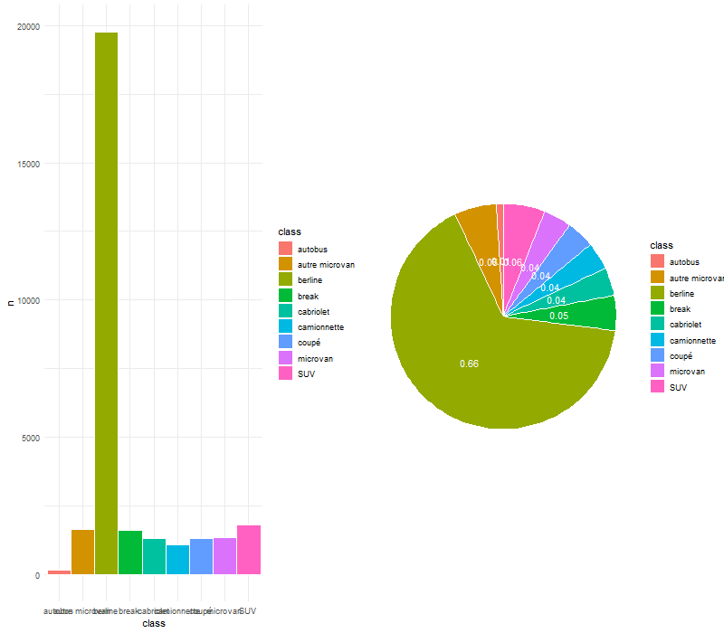
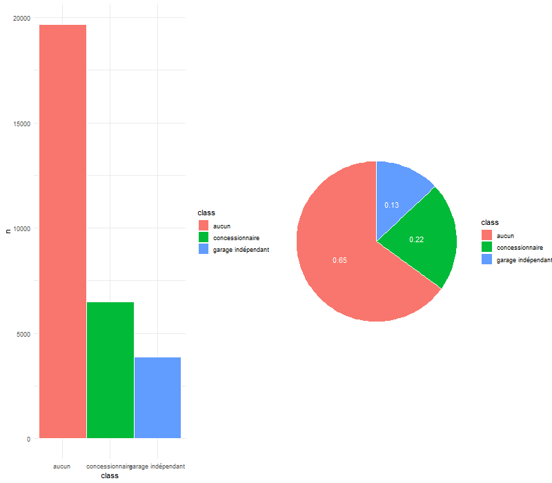

```{r setup, include=FALSE}
knitr::opts_chunk$set(echo=TRUE,message=FALSE, warning=FALSE)
```

```{r, echo= FALSE}
# Installation des packages utilisées dans ce projet

#install.packages(c("xts","sp","zoo"))
#install.packages("Hmisc")
#install.packages(c("FactoMineR", "factoextra"))
#install.packages("cowplot")

# Installation du package CASdatasets contenant les 2 jeux de données sur lesquels nous allons travaillés

#install.packages("CASdatasets", repos = "http://dutangc.free.fr/pub/RRepos/", type="source")

# Importation des librairies nécessaires aux datasets

library(zoo)
library(xts)
library(sp)
library(CASdatasets)

# Chargement des 2 jeux de données freMPL1 et freMPL2
data(freMPL1)
data(freMPL2)
```

# Présentation du projet

# Exploration des jeux de données freMPL1 et freMPL2

Un peu à la manière du machine learning, les données contenues dans freMPL2 serviront de données d'entraînement de notre modèle et les données de freMPL1 serviront pour tester notre modèle final.

## freMPL2

### Première exploration du jeu de données d'entraînement : freMPL2


Dans un premier temps, regardons les premières lignes du jeu de données  
```{r, echo=FALSE}
knitr::kable(t(head(freMPL2,3)))
```

```{r, echo=FALSE}
dim_freMPL2 <- dim(freMPL2)
```
Les dimmensions de notre jeu de données sont (`r dim_freMPL2`).
Ainsi, notre jeu contient `r dim_freMPL2[1]` données différentes, toutes définies par `r dim_freMPL2[2]` caractéristiques différentes. 

```{r,echo=FALSE}
colnames_freMPL2 <- colnames(freMPL2)
```
Les noms des différentes caractéristiques sont :

- **`r colnames_freMPL2[1]`** : 
- **`r colnames_freMPL2[2]`** : 
- **`r colnames_freMPL2[3]`** : 
- **`r colnames_freMPL2[4]`** : 
- **`r colnames_freMPL2[5]`** : 
- **`r colnames_freMPL2[6]`** : 
- **`r colnames_freMPL2[7]`** : 
- **`r colnames_freMPL2[8]`** : 
- **`r colnames_freMPL2[9]`** : 
- **`r colnames_freMPL2[10]`** : 
- **`r colnames_freMPL2[11]`** : 
- **`r colnames_freMPL2[12]`** : 
- **`r colnames_freMPL2[13]`** : 
- **`r colnames_freMPL2[14]`** : 
- **`r colnames_freMPL2[15]`** : 
- **`r colnames_freMPL2[16]`** : 
- **`r colnames_freMPL2[17]`** : 
- **`r colnames_freMPL2[18]`** : 
- **`r colnames_freMPL2[19]`** : 
- **`r colnames_freMPL2[20]`** :
- **`r colnames_freMPL2[21]`** :
- **`r colnames_freMPL2[22]`** :

### Nettoyage de données

Remarquons qu'il serait intéressant de faire un peu de nettoyage de données avant d'effectuer quelconques travaux sur celles-ci.
Pour cela, nous allons créer une fonction qui servira à nettoyer les 2 dataframes.

Cette fonction (appelée nettoyage_dataframe) prend l'un des deux dataframes en paramètres et effectue les opérations suivantes :

- Suppression des données des individus assurés moins d'un jour (Exposure)
- Modification des données des individus ayant un ClaimAmount négatif
- Suppression de la colonne associée au sexe de la personne
- Réduction du nombre de catégories socioprofessionnels
- Traduction des données (VehBody, MariStat, VehUsage, VehEngine, VehEnergy, Garage)

```{r, echo=FALSE}
nettoyage_dataframe <- function(dt){
  
  # Suppression des données des individus assurés moins d'un jour (Exposure)
  dt <- subset(dt,dt$Exposure>1/365.25)
  
  # Modification des données des individus ayant un ClaimAmount négatif
  dt <- subset(dt,dt$ClaimAmount>=0)
  
  # Suppression de la colonne associée au sexe de la personne
  dt <- dt[,-6]
  
  # Réduction du nombre de catégories socioprofessionnels
  levels(dt$SocioCateg) <- c(levels(dt$SocioCateg), "CSP4", "CSP6",
                                    "CSP9")
  for (i in 1:dim(dt)[1]){
    if (dt$SocioCateg[i]%in%c("CSP1","CSP16","CSP18","CSP19")){
      dt$SocioCateg[i]<-"CSP1"
      }
    if (dt$SocioCateg[i]%in%c("CSP2", "CSP20", "CSP21", "CSP22", "CSP23",
                                     "CSP25", "CSP26","CSP27", "CSP28")){
      dt$SocioCateg[i]<-"CSP2"
      }
    if (dt$SocioCateg[i]%in%c("CSP3", "CSP30", "CSP31", "CSP32", "CSP33",
                                     "CSP35", "CSP36","CSP37", "CSP38", "CSP39")){
      dt$SocioCateg[i]<-"CSP3"
      }
    if (dt$SocioCateg[i]%in%c("CSP40", "CSP41", "CSP42", "CSP43", "CSP46",
                                     "CSP47", "CSP48","CSP49")){
      dt$SocioCateg[i]<-"CSP4"
      }
    if (dt$SocioCateg[i]%in%c("CSP5", "CSP50", "CSP51", "CSP55", "CSP56", 
                                     "CSP57", "CSP59")){
      dt$SocioCateg[i]<-"CSP5"
      }
    if (dt$SocioCateg[i]%in%c("CSP6", "CSP60", "CSP61", "CSP62", "CSP63",
                                     "CSP65", "CSP66")){
      dt$SocioCateg[i]<-"CSP6"
      }
    if (dt$SocioCateg[i]%in%c("CSP7", "CSP70", "CSP73", "CSP74", "CSP77")){
      dt$SocioCateg[i]<-"CSP7"
      }
    if (dt$SocioCateg[i]%in%c("CSP9", "CSP91")){
      dt$SocioCateg[i]<-"CSP9"
      }
  }
  dt$SocioCateg <- droplevels(dt$SocioCateg)
  
  # Traduction des données (VehBody, MariStat, VehUsage, VehEngine, VehEnergy, Garage)
  for (i in 1:dim(dt)[2]){
    # Type de véhicules
    if (colnames(dt)[i]=="VehBody"){
      levels(dt$VehBody) <- c(levels(dt$VehBody), "autobus", "coupé",
                                     "autre microvan", "berline","SUV", "break",
                                     "camionnette")
      dt$VehBody[dt$VehBody == "bus"]<-"autobus"
      dt$VehBody[dt$VehBody == "coupe"]<-"coupé"
      dt$VehBody[dt$VehBody == "other microvan"]<-"autre microvan"
      dt$VehBody[dt$VehBody == "sedan"]<-"berline"
      dt$VehBody[dt$VehBody == "sport utility vehicle"]<-"SUV"
      dt$VehBody[dt$VehBody == "station wagon"]<-"break"
      dt$VehBody[dt$VehBody == "van"]<-"camionnette"
      dt$VehBody <- droplevels(dt$VehBody)
      }
    # Statut marital
    if (colnames(dt)[i]=="MariStat"){
      levels(dt$MariStat) <- c(levels(dt$MariStat), "célibataire", "autre")
      dt$MariStat[dt$MariStat == "Alone"]<-"célibataire"
      dt$MariStat[dt$MariStat == "Other"]<-"autre"
      dt$MariStat <- droplevels(dt$MariStat)
      }
    # Utilisation du véhicule
    if (colnames(dt)[i]=="VehUsage"){
      levels(dt$VehUsage) <- c(levels(dt$VehUsage), "privée", 
                                      "privée et trajet vers bureau", "professionnel", 
                                      "trajet professionnel" )
      dt$VehUsage[dt$VehUsage == "Private"]<-"privée"
      dt$VehUsage[dt$VehUsage == "Private+trip to office"]<-
      "privée et trajet vers bureau"
      dt$VehUsage[dt$VehUsage == "Professional"]<-"professionnel"
      dt$VehUsage[dt$VehUsage == "Professional run"]<-
      "trajet professionnel"
      dt$VehUsage <- droplevels(dt$VehUsage)
      }
    # Moteur du véhicule
    if (colnames(dt)[i]=="VehEngine"){
      levels(dt$VehEngine) <- c(levels(dt$VehEngine), 
                                       "injection directe surpuissante",
                                       "électrique", "injection surpuissante")
      dt$VehEngine[dt$VehEngine == "direct injection overpowered"]<-
      "injection directe surpuissante"
      dt$VehEngine[dt$VehEngine == "electric"]<-"électrique"
      dt$VehEngine[dt$VehEngine == "injection overpowered"]<-
      "injection surpuissante"
      dt$VehEngine <- droplevels(dt$VehEngine)
      }
    # Energie utilisée par le véhicule
    if (colnames(dt)[i]=="VehEnergy"){
      levels(dt$VehEnergy) <- c(levels(dt$VehEnergy), "électrique", "essence")
      dt$VehEnergy[dt$VehEnergy == "regular"]<-"essence"
      dt$VehEnergy[dt$VehEnergy == "eletric"]<-"électrique"
      dt$VehEnergy <- droplevels(dt$VehEnergy)
      }
    # Garage
    if (colnames(dt)[i]=="Garage"){
      levels(dt$Garage) <- c(levels(dt$Garage), "aucun", "garage indépendant",
                                    "concessionnaire")
      dt$Garage[dt$Garage == "None"]<-"aucun"
      dt$Garage[dt$Garage == "Private garage"]<-"garage indépendant"
      dt$Garage[dt$Garage == "Collective garage"]<-"concessionnaire"
      dt$Garage <- droplevels(dt$Garage)
    }
  }
  return (dt)
}
```

```{r, echo=FALSE}
# nettoyage de nos 2 dataframes : 

freMPL2 <- nettoyage_dataframe(freMPL2)
freMPL1 <- nettoyage_dataframe(freMPL1)
```

### Statistiques descriptives 

Regardons maintenant les différents types d'objets figurant dans les colonnes :  
```{r, echo = FALSE, eval = FALSE}
str(freMPL2)
```
Nous avons donc des objets de type numeric, de type factor, de type int et même de type date. 

Regardons maintenant plus précisement les valeurs particulières de ces colonnes (valeurs minimum et maximum, moyenne, médiane,quantiles, ...)

```{r, echo = FALSE, eval = FALSE}
summary(freMPL2)
```
On remarquera qu'il existe des données manquantes dans la colonne RecEnd, ce qui signifie que les individus concernés sont toujours assurés. 

On peut aussi utiliser la méthode describe du package Hmisc pour avoir un aperçu de la dispersion des données.

```{r, echo = FALSE, eval = FALSE}
library("Hmisc")
describe(freMPL2)
```
Mais cela ne vaut pas une représentation graphique.

### Représentations graphiques des données

```{r}
# On met les colonnes dans le même ordre

freMPL1 <- freMPL1[,c(1:17,19,18,20:21)]
```


```{r, echo=FALSE}
library("ggplot2")
library("dplyr") 
library("cowplot")

representation_graphique <- function(dataframe, col){
  indice_col <-  which(colnames(dataframe) == col)
  if(indice_col %in% c(1,2,9,11,18,19)){
    par(fig=c(0.1,1,0.1,0.7), mar = c(0,0,2,2))
    hist(dataframe[,indice_col],
      main = paste(col))
    par(fig=c(0.1,1,0.8,1), mar = c(0,0,2,2), new = TRUE)
    boxplot(dataframe[,indice_col], data = dataframe, horizontal = TRUE)
  }else{
    if(indice_col %in% c(5)){
      dt <- data.frame(
        class = c("0","1","2","3","4","5","6-7","8-9","10+"),
        n = as.data.frame(table(dataframe[,indice_col]))[,2],
        prop = as.data.frame(round(prop.table(table(dataframe[,indice_col])),2))[,2]
        )
      dt <- dt %>%
        arrange(desc(class)) %>%
        mutate(lab.ypos = cumsum(prop) - 0.5*prop)
      barre <- ggplot(dt, aes(x = class, y = n, fill = class)) +
        geom_bar(width = 1, stat = "identity", color = "white")+
        theme_minimal()
      camembert <- ggplot(dt, aes(x = "", y = prop, fill = class)) +
        geom_bar(width = 1, stat = "identity", color = "white") +
        coord_polar("y", start = 0)+
        geom_text(aes(y = lab.ypos, label = prop), color = "white")+
        theme_void()
      plot_grid(barre, camembert, ncol = 2, nrow = 1)
    }else{
      if(indice_col %in% c(10,21)){
        dt <- data.frame(
          class = c("0","1"),
          n = as.data.frame(table(dataframe[,indice_col]))[,2],
          prop = as.data.frame(round(prop.table(table(dataframe[,indice_col])),2))[,2]
          )
        dt <- dt %>%
          arrange(desc(class)) %>%
          mutate(lab.ypos = cumsum(prop) - 0.5*prop)
        barre <- ggplot(dt, aes(x = class, y = n, fill = class)) +
          geom_bar(width = 1, stat = "identity", color = "white")+
          theme_minimal()
        camembert <- ggplot(dt, aes(x = "", y = prop, fill = class)) +
          geom_bar(width = 1, stat = "identity", color = "white") +
          coord_polar("y", start = 0)+
          geom_text(aes(y = lab.ypos, label = prop), color = "white")+
          theme_void()
        plot_grid(barre, camembert, ncol = 2, nrow = 1)
      }else{
        dt <- data.frame(
          class = levels(dataframe[,indice_col]),
          n = as.data.frame(table(dataframe[,indice_col]))[,2],
          prop = as.data.frame(round(prop.table(table(dataframe[,indice_col])),2))[,2]
          )
        dt <- dt %>%
          arrange(desc(class)) %>%
          mutate(lab.ypos = cumsum(prop) - 0.5*prop)
        barre <- ggplot(dt, aes(x = class, y = n, fill = class)) +
          geom_bar(width = 1, stat = "identity", color = "white")+
          theme_minimal()
        camembert <- ggplot(dt, aes(x = "", y = prop, fill = class)) +
          geom_bar(width = 1, stat = "identity", color = "white") +
          coord_polar("y", start = 0)+
          geom_text(aes(y = lab.ypos, label = prop), color = "white")+
          theme_void()
        plot_grid(barre, camembert, ncol = 2, nrow = 1)
      }
    }
  }
}
```

```{r, echo = FALSE}
png(file = "graphique/Exposure1.png", width = 800, height = 700)
representation_graphique(freMPL1,colnames(freMPL1)[1])
dev.off()
png(file = "graphique/LicAge1.png", width = 800, height = 700)
representation_graphique(freMPL1,colnames(freMPL1)[2])
dev.off()
png(file = "graphique/VehAge1.png", width = 800, height = 700)
representation_graphique(freMPL1,colnames(freMPL1)[5])
dev.off()
png(file = "graphique/MariStat1.png", width = 800, height = 700)
representation_graphique(freMPL1,colnames(freMPL1)[6])
dev.off()
png(file = "graphique/SocioCateg1.png", width = 800, height = 700)
representation_graphique(freMPL1,colnames(freMPL1)[7])
dev.off()
png(file = "graphique/VehUsage1.png", width = 800, height = 700)
representation_graphique(freMPL1,colnames(freMPL1)[8])
dev.off()
png(file = "graphique/DrivAge1.png", width = 800, height = 700)
representation_graphique(freMPL1,colnames(freMPL1)[9])
dev.off()
png(file = "graphique/HasKmLimit1.png", width = 800, height = 700)
representation_graphique(freMPL1,colnames(freMPL1)[10])
dev.off()
png(file = "graphique/BonusMalus1.png", width = 800, height = 700)
representation_graphique(freMPL1,colnames(freMPL1)[11])
dev.off()
png(file = "graphique/VehBody1.png", width = 800, height = 700)
representation_graphique(freMPL1,colnames(freMPL1)[12])
dev.off()
png(file = "graphique/VehPrice1.png", width = 800, height = 700)
representation_graphique(freMPL1,colnames(freMPL1)[13])
dev.off()
png(file = "graphique/VehEngine1.png", width = 800, height = 700)
representation_graphique(freMPL1,colnames(freMPL1)[14])
dev.off()
png(file = "graphique/VehEnergy1.png", width = 800, height = 700)
representation_graphique(freMPL1,colnames(freMPL1)[15])
dev.off()
png(file = "graphique/VehMaxSpeed1.png", width = 800, height = 700)
representation_graphique(freMPL1,colnames(freMPL1)[16])
dev.off()
png(file = "graphique/VehClass1.png", width = 800, height = 700)
representation_graphique(freMPL1,colnames(freMPL1)[17])
dev.off()
png(file = "graphique/RiskVar1.png", width = 800, height = 700)
representation_graphique(freMPL1,colnames(freMPL1)[18])
dev.off()
png(file = "graphique/ClaimAmount1.png", width = 800, height = 700)
representation_graphique(freMPL1,colnames(freMPL1)[19])
dev.off()
png(file = "graphique/Garage1.png", width = 800, height = 700)
representation_graphique(freMPL1,colnames(freMPL1)[20])
dev.off()
png(file = "graphique/ClaimInd1.png", width = 800, height = 700)
representation_graphique(freMPL1,colnames(freMPL1)[21])
dev.off()

png(file = "graphique/Exposure2.png", width = 800, height = 700)
representation_graphique(freMPL2,colnames(freMPL2)[1])
dev.off()
png(file = "graphique/LicAge2.png", width = 800, height = 700)
representation_graphique(freMPL2,colnames(freMPL2)[2])
dev.off()
png(file = "graphique/VehAge2.png", width = 800, height = 700)
representation_graphique(freMPL2,colnames(freMPL2)[5])
dev.off()
png(file = "graphique/MariStat2.png", width = 800, height = 700)
representation_graphique(freMPL2,colnames(freMPL2)[6])
dev.off()
png(file = "graphique/SocioCateg2.png", width = 800, height = 700)
representation_graphique(freMPL2,colnames(freMPL2)[7])
dev.off()
png(file = "graphique/VehUsage2.png", width = 800, height = 700)
representation_graphique(freMPL2,colnames(freMPL2)[8])
dev.off()
png(file = "graphique/DrivAge2.png", width = 800, height = 700)
representation_graphique(freMPL2,colnames(freMPL2)[9])
dev.off()
png(file = "graphique/HasKmLimit2.png", width = 800, height = 700)
representation_graphique(freMPL2,colnames(freMPL2)[10])
dev.off()
png(file = "graphique/BonusMalus2.png", width = 800, height = 700)
representation_graphique(freMPL2,colnames(freMPL2)[11])
dev.off()
png(file = "graphique/VehBody2.png", width = 800, height = 700)
representation_graphique(freMPL2,colnames(freMPL2)[12])
dev.off()
png(file = "graphique/VehPrice2.png", width = 800, height = 700)
representation_graphique(freMPL2,colnames(freMPL2)[13])
dev.off()
png(file = "graphique/VehEngine2.png", width = 800, height = 700)
representation_graphique(freMPL2,colnames(freMPL2)[14])
dev.off()
png(file = "graphique/VehEnergy2.png", width = 800, height = 700)
representation_graphique(freMPL2,colnames(freMPL2)[15])
dev.off()
png(file = "graphique/VehMaxSpeed2.png", width = 800, height = 700)
representation_graphique(freMPL2,colnames(freMPL2)[16])
dev.off()
png(file = "graphique/VehClass2.png", width = 800, height = 700)
representation_graphique(freMPL2,colnames(freMPL2)[17])
dev.off()
png(file = "graphique/RiskVar2.png", width = 800, height = 700)
representation_graphique(freMPL2,colnames(freMPL2)[18])
dev.off()
png(file = "graphique/ClaimAmount2.png", width = 800, height = 700)
representation_graphique(freMPL2,colnames(freMPL2)[19])
dev.off()
png(file = "graphique/Garage2.png", width = 800, height = 700)
representation_graphique(freMPL2,colnames(freMPL2)[20])
dev.off()
png(file = "graphique/ClaimInd2.png", width = 800, height = 700)
representation_graphique(freMPL2,colnames(freMPL2)[21])
dev.off()
```


### ACP 

L'ACP permet d’analyser et de visualiser un jeu de données contenant des individus décrits par plusieurs variables quantitatives.
C’est une méthode statistique qui permet d’explorer des données dites multivariées (données avec plusieurs variables). Chaque variable pourrait être considérée comme une dimension différente.
L’analyse en composantes principales est utilisée pour extraire et de visualiser les informations importantes contenues dans une table de données multivariées. L’ACP synthétise cette information en seulement quelques nouvelles variables appelées composantes principales. Ces nouvelles variables correspondent à une combinaison linéaire des variables originels. Le nombre de composantes principales est inférieur ou égal au nombre de variables d’origine.

#### Exécution sur nos données freMPL2

Attention, les valeurs doivent être numériques.

On va donc convertir nos valeurs en numérique :
```{r}
freMPL2$LicAge <- as.numeric(freMPL2$LicAge)
freMPL2$DrivAge <- as.numeric(freMPL2$DrivAge)
freMPL2$BonusMalus <- as.numeric(freMPL2$BonusMalus)
freMPL2$RiskVar <- as.numeric(freMPL2$RiskVar)
freMPL2$ClaimAmount <- as.numeric(freMPL2$ClaimAmount)
```

Certaines colonnes sont catégorisés et pourraient nous être utiles pour éxécuter notre ACP.
Il n'est cependant pas judicieux d'appliquer une conversion numérique à ces colonnes puisqu'on leur attribue une valeur arbitraire nous faisant penser à une classification des différents facteurs possibles. Pour éviter cela, on va donc utiliser la méthode model.matrix() qui crée une matrice binaire spécifiant à quel facteur correspond une ligne du dataframe.


```{r}
library("FactoMineR")
library("factoextra") # Pour la visualisation 
```

```{r}
freMPL2.active <- freMPL2[,c(1:2,9,11, 18:19)]
freMPL2.pca <- PCA(freMPL2.active, graph = FALSE)
```

Affichage du résultat : 

```{r}
get_eigenvalue(freMPL2.pca)
fviz_eig(freMPL2.pca)
```

utilisation de cos2 pour juger de la qualité de la représentation :

```{r}
fviz_pca_var(freMPL2.pca, col.var = "cos2",
             gradient.cols = c("#00AFBB", "#E7B800", "#FC4E07"),
             repel = TRUE # Évite le chevauchement de texte
             )
```

contribution des colonnes aux dimensions : 

```{r}
fviz_pca_var(freMPL2.pca, col.var = "contrib",
             gradient.cols = c("#00AFBB", "#E7B800", "#FC4E07")
             )
```
Description des dimensions

Dans les sections précédentes, nous avons décrit comment mettre en évidence les variables en fonction de leurs contributions aux composantes principales.

Notez également que la fonction dimdesc() [dans FactoMineR], pour dimension description (en anglais), peut être utilisée pour identifier les variables les plus significativement associées avec une composante principale donnée . Elle peut être utilisée comme suit:

```{r, eval = FALSE}
freMPL2.desc <- dimdesc(freMPL2.pca, axes = c(1,2), proba = 0.05)
head(freMPL2.desc)
```

###### AFC 

L’ analyse factorielle des correspondances est une extension de l’analyse en composantes principales pour analyser l’association entre deux variables qualitatives (ou catégorielles).
L’AFC permet de résumer et de visualiser l’information contenue dans le tableau de contingence formé par les deux variables catégorielles. Le tableau de contingence contient les fréquences formées par les deux variables.

```{r}
library ("FactoMineR")
freMPL2.ca <- CA (freMPL2.active)
```

```{r}
get_eigenvalue(freMPL2.ca)
fviz_screeplot (freMPL2.ca, addlabels = TRUE)
```

```{r}
fviz_ca_col (freMPL2.ca, col.col = "cos2",
             gradient.cols = c("#00AFBB", "#E7B800", "#FC4E07"),
             repel = TRUE)
fviz_cos2 (freMPL2.ca, choice = "col", axes = 1:2)
```

```{r}
res.desc <- dimdesc(freMPL2.ca, axes = c(1, 2))
res.desc[[1]]$col
```


# GLM 

```{r}
#calibration d’une loi de Poisson
fpois <- glm(RiskVar~DrivAge+VehAge+VehClass+VehBody+VehEnergy, offset=log(Exposure), family=poisson("log"), data=freMPL2)
summary(fpois)

#calibration d’une loi Poisson sur-dispersée
fpois2 <- glm(RiskVar~DrivAge+VehAge+VehClass+VehBody+VehEnergy, offset=log(Exposure), family=quasipoisson("log"), data=freMPL2)
summary(fpois2)
```

# Bibliographie


# Annexes

## Affichage de l'implementation de la fonction nettoyage_dataframe : 

```
nettoyage_dataframe <- function(dt){
  
  # Suppression des données des individus assurés moins d'un jour (Exposure)
  dt <- subset(dt,dt$Exposure>1/365.25)
  
  # Modification des données des individus ayant un ClaimAmount négatif
  dt <- subset(dt,dt$ClaimAmount>=0)
  
  # Suppression de la colonne associée au sexe de la personne
  dt <- dt[,-6]
  
  # Réduction du nombre de catégories socioprofessionnels
  levels(dt$SocioCateg) <- c(levels(dt$SocioCateg), "CSP4", "CSP6",
                                    "CSP9")
  for (i in 1:dim(dt)[1]){
    if (dt$SocioCateg[i]%in%c("CSP1","CSP16","CSP18","CSP19")){
      dt$SocioCateg[i]<-"CSP1"
      }
    if (dt$SocioCateg[i]%in%c("CSP2", "CSP20", "CSP21", "CSP22", "CSP23",
                                     "CSP25", "CSP26","CSP27", "CSP28")){
      dt$SocioCateg[i]<-"CSP2"
      }
    if (dt$SocioCateg[i]%in%c("CSP3", "CSP30", "CSP31", "CSP32", "CSP33",
                                     "CSP35", "CSP36","CSP37", "CSP38", "CSP39")){
      dt$SocioCateg[i]<-"CSP3"
      }
    if (dt$SocioCateg[i]%in%c("CSP40", "CSP41", "CSP42", "CSP43", "CSP46",
                                     "CSP47", "CSP48","CSP49")){
      dt$SocioCateg[i]<-"CSP4"
      }
    if (dt$SocioCateg[i]%in%c("CSP5", "CSP50", "CSP51", "CSP55", "CSP56", 
                                     "CSP57", "CSP59")){
      dt$SocioCateg[i]<-"CSP5"
      }
    if (dt$SocioCateg[i]%in%c("CSP6", "CSP60", "CSP61", "CSP62", "CSP63",
                                     "CSP65", "CSP66")){
      dt$SocioCateg[i]<-"CSP6"
      }
    if (dt$SocioCateg[i]%in%c("CSP7", "CSP70", "CSP73", "CSP74", "CSP77")){
      dt$SocioCateg[i]<-"CSP7"
      }
    if (dt$SocioCateg[i]%in%c("CSP9", "CSP91")){
      dt$SocioCateg[i]<-"CSP9"
      }
  }
  dt$SocioCateg <- droplevels(dt$SocioCateg)
  
  # Traduction des données (VehBody, MariStat, VehUsage, VehEngine, VehEnergy, Garage)
  for (i in 1:dim(dt)[2]){
    # Type de véhicules
    if (colnames(dt)[i]=="VehBody"){
      levels(dt$VehBody) <- c(levels(dt$VehBody), "autobus", "coupé",
                                     "autre microvan", "berline","SUV", "break",
                                     "camionnette")
      dt$VehBody[dt$VehBody == "bus"]<-"autobus"
      dt$VehBody[dt$VehBody == "coupe"]<-"coupé"
      dt$VehBody[dt$VehBody == "other microvan"]<-"autre microvan"
      dt$VehBody[dt$VehBody == "sedan"]<-"berline"
      dt$VehBody[dt$VehBody == "sport utility vehicle"]<-"SUV"
      dt$VehBody[dt$VehBody == "station wagon"]<-"break"
      dt$VehBody[dt$VehBody == "van"]<-"camionnette"
      dt$VehBody <- droplevels(dt$VehBody)
      }
    # Statut marital
    if (colnames(dt)[i]=="MariStat"){
      levels(dt$MariStat) <- c(levels(dt$MariStat), "célibataire", "autre")
      dt$MariStat[dt$MariStat == "Alone"]<-"célibataire"
      dt$MariStat[dt$MariStat == "Other"]<-"autre"
      dt$MariStat <- droplevels(dt$MariStat)
      }
    # Utilisation du véhicule
    if (colnames(dt)[i]=="VehUsage"){
      levels(dt$VehUsage) <- c(levels(dt$VehUsage), "privée", 
                                      "privée et trajet vers bureau", "professionnel", 
                                      "trajet professionnel" )
      dt$VehUsage[dt$VehUsage == "Private"]<-"privée"
      dt$VehUsage[dt$VehUsage == "Private+trip to office"]<-
      "privée et trajet vers bureau"
      dt$VehUsage[dt$VehUsage == "Professional"]<-"professionnel"
      dt$VehUsage[dt$VehUsage == "Professional run"]<-
      "trajet professionnel"
      dt$VehUsage <- droplevels(dt$VehUsage)
      }
    # Moteur du véhicule
    if (colnames(dt)[i]=="VehEngine"){
      levels(dt$VehEngine) <- c(levels(dt$VehEngine), 
                                       "injection directe surpuissante",
                                       "électrique", "injection surpuissante")
      dt$VehEngine[dt$VehEngine == "direct injection overpowered"]<-
      "injection directe surpuissante"
      dt$VehEngine[dt$VehEngine == "electric"]<-"électrique"
      dt$VehEngine[dt$VehEngine == "injection overpowered"]<-
      "injection surpuissante"
      dt$VehEngine <- droplevels(dt$VehEngine)
      }
    # Energie utilisée par le véhicule
    if (colnames(dt)[i]=="VehEnergy"){
      levels(dt$VehEnergy) <- c(levels(dt$VehEnergy), "électrique", "essence")
      dt$VehEnergy[dt$VehEnergy == "regular"]<-"essence"
      dt$VehEnergy[dt$VehEnergy == "eletric"]<-"électrique"
      dt$VehEnergy <- droplevels(dt$VehEnergy)
      }
    # Garage
    if (colnames(dt)[i]=="Garage"){
      levels(dt$Garage) <- c(levels(dt$Garage), "aucun", "garage indépendant",
                                    "concessionnaire")
      dt$Garage[dt$Garage == "None"]<-"aucun"
      dt$Garage[dt$Garage == "Private garage"]<-"garage indépendant"
      dt$Garage[dt$Garage == "Collective garage"]<-"concessionnaire"
      dt$Garage <- droplevels(dt$Garage)
    }
  }
  return (dt)
}
```


## Affichage de l'ensemble des représentations graphiques

|| **freMPL1**  	| **freMPL2** 	|
|:-:|:-:|:-:|
|**`r colnames_freMPL2[1]`**|{width=40%}|{width=40%}|
|**`r colnames_freMPL2[2]`**   	|{width=40%}   	| {width=40%}  	|
|  **`r colnames_freMPL2[5]`** 	|{width=40%}|{width=40%}|
| **`r colnames_freMPL2[6]`**  	|{width=40%}|{width=40%}|
| **`r colnames_freMPL2[7]`**  	|{width=40%}|{width=40%}|
| **`r colnames_freMPL2[8]`**  	| {width=40%}|{width=40%}|
| **`r colnames_freMPL2[9]`**  	|{width=40%}|{width=40%}|
| **`r colnames_freMPL2[10]`**  	|   {width=40%}|{width=40%}|
|**`r colnames_freMPL2[11]`**   	| {width=40%}|{width=40%}|
|**`r colnames_freMPL2[12]`**   	| {width=40%}|{width=40%}|
|**`r colnames_freMPL2[13]`**   	| {width=40%}|{width=40%}|
| **`r colnames_freMPL2[14]`**  	|{width=40%}|{width=40%}|
| **`r colnames_freMPL2[15]`**  	| {width=40%}|{width=40%}|
| **`r colnames_freMPL2[16]`**  	| {width=40%}|{width=40%}|
|   **`r colnames_freMPL2[17]`**	| {width=40%}|{width=40%}|
| **`r colnames_freMPL2[18]`**  	|{width=40%}|{width=40%}|
| **`r colnames_freMPL2[19]`**  	| {width=40%}|{width=40%}|
| **`r colnames_freMPL2[20]`**  	| {width=40%}|{width=40%}|
| **`r colnames_freMPL2[21]`**  	| {width=40%}|{width=40%}|
