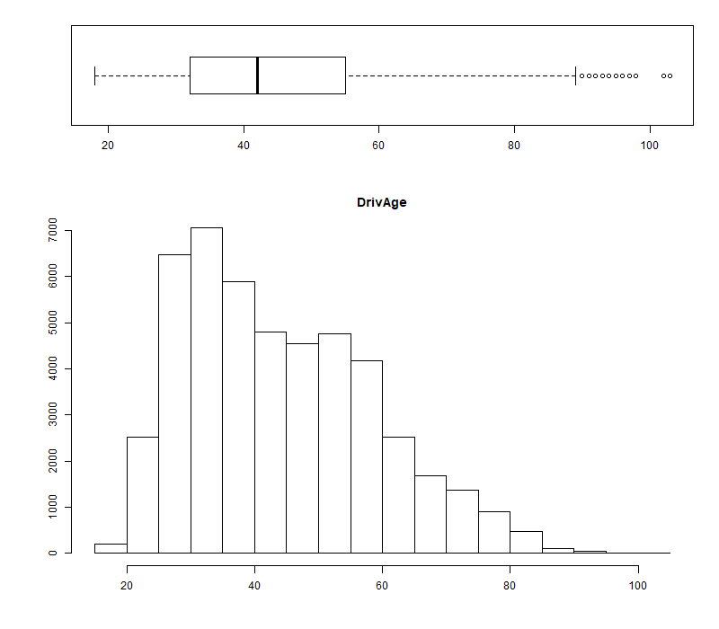
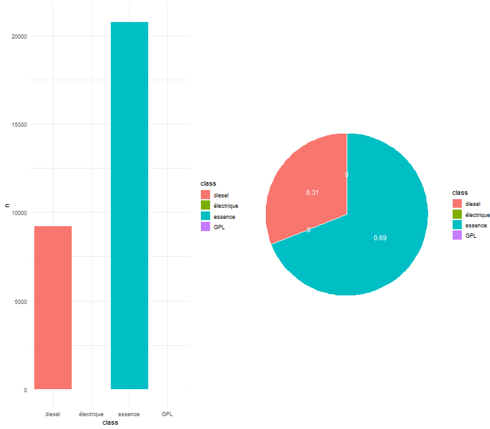

```{r setup, include=FALSE}
knitr::opts_chunk$set(echo=FALSE, message=FALSE, warning=FALSE)
```

```{r}
# Installation des packages utilisées dans ce projet

#install.packages(c("xts","sp","zoo"))
#install.packages("Hmisc")
#install.packages(c("FactoMineR", "factoextra"))
#install.packages("cowplot")
#install.packages("summarytools")

# Installation du package CASdatasets contenant les 2 jeux de données sur lesquels nous allons travaillés

#install.packages("CASdatasets", repos = "http://dutangc.free.fr/pub/RRepos/", type="source")

# Importation des librairies nécessaires aux datasets

library(zoo)
library(xts)
library(sp)
library(CASdatasets)

# Chargement des 2 jeux de données freMPL1 et freMPL2
data(freMPL1)
data(freMPL2)
```

# Présentation du projet

|    L’assurance est un contrat par lequel, moyennant le versement d’une prime dont le montant est fixé à priori (en début de période de couverture), l’assureur s’engage à indemniser l’assuré pendant toute la période de couverture (généralement un an). Cette prime doit refléter le risque associé au contrat.   
|    Pour chaque police d’assurance, la prime est fonction de variables dites de tarification permettant de segmenter la population en fonction de son risque. Il est usuel d’utiliser une approche fréquence/sévérité ou une approche indemnitaire pour modéliser le coût annuel d’une police d’assurance. Sur les données utilisées dans ce projet, nous utiliserons cette dernière approche car on ne dispose pas des montants individuels de sinistre.  
|    Le but de ce projet est de proposer un tarificateur en se basant deux méthodes : les modèles linéaires généralisés (GLM) et les modèles additifs généralisés (GAM). Ces derniers sont une extension des GLM (proposé par McCullagh et Nelder, 1989) en considérant une approche non-paramétrique pour le prédicteur.  
|    Un second objectif sera, en plus de calculer une prime pure par police, de déterminer une commerciale intégrant une marge pour risque. Une approche par simulation sera réalisée pour juger de l’adéquation du chargement par rapport à la charge sinistre totale portefeuille.

# Exploration des jeux de données freMPL1 et freMPL2

Un peu à la manière du machine learning, les données contenues dans freMPL2 serviront de données d'entraînement de notre modèle et les données de freMPL1 serviront pour tester notre modèle final.

## Première visualisation des jeux de données 

```{r}
dim_freMPL1 <- dim(freMPL1)
dim_freMPL2 <- dim(freMPL2)
```

|    Les dimensions du jeu de données **freMPL1** sont (`r dim_freMPL1`).
Ainsi, notre jeu contient `r dim_freMPL1[1]` données différentes, toutes définies par `r dim_freMPL1[2]` caractéristiques différentes. 

|    De même, les dimensions du jeu de données **freMPL2** sont (`r dim_freMPL2`).
Ainsi, notre jeu contient `r dim_freMPL2[1]` données différentes, toutes définies par `r dim_freMPL2[2]` caractéristiques différentes. 

```{r, results='hide'}
colnames_freMPL1 <- colnames(freMPL1)
colnames_freMPL2 <- colnames(freMPL2) 
# Les noms des colonnes sont les mêmes. La seule différence entre nos 2 tableaux est l'inversion entre les colonnes RiskVar et ClaiAmount. 
# Regardons aussi les différents types d'objets figurant dans les colonnes :  
str(freMPL2)
# On constate qu'il y a de nombreux types de données : des données numériques, des données descriptives (ex : Il y a troix types de garages : "collective garage", "None" et "Private Garage")
```

Les noms des caractéristiques des jeux de données sont les mêmes. ses différentes caractéristiques sont :

- **`r colnames_freMPL2[1]`** : il s'agit d'une donnée de type numérique qui correspond à la fréquence d'exposition aux risques d'un individu sur une année. Par exemple, si l'individu a été exposé 100 jours, le chiffre affiché est 0,27 (= 100/365,25).
- **`r colnames_freMPL2[2]`** : c'est un nombre entier de mois correspondant à l'âge de la licence de la personne concernée.
- **`r colnames_freMPL2[3]`** : cela correspond à la date de début d'exposition aux risques.
- **`r colnames_freMPL2[4]`** : c'est la date de fin d'exposition aux risques. Si elle n'est pas renseignée, c'est que la personne est toujours exposée.
- **`r colnames_freMPL2[5]`** : Il correspond à l'âge du véhicule en année(s). Il est composé en 9 catégories distinctes : "0", "1", "2", "3", "4", "5", "6-7", "8-9" et "10+".
- **`r colnames_freMPL2[6]`** : c'est le sexe de l'individu.
- **`r colnames_freMPL2[7]`** : il s'agit du statut marital de la personne. Elle est soit célibataire ("Alone") soit autre chose ("Other").
- **`r colnames_freMPL2[8]`** : Cela correspond à la catégorie socioprofessionnelle de l'individu. Les valeurs, comprises entre "CSP1" et "CSP99", correspondent à la classification française (voir lien suivant : <https://fr.wikipedia.org/wiki/Professions_et_catégories_socioprofessionnelles_en_France>). 
- **`r colnames_freMPL2[9]`** : Cela correspond à l'utilisation du véhicule par le propriétaire. Son utilisation peut être soit privée ("Private"), soit professionnelle ("Professional"), ...
- **`r colnames_freMPL2[10]`** : C'est l'âge du conducteur (en années). Pour rappel, en France, la conduite est possible à partir de 18 ans.
- **`r colnames_freMPL2[11]`** : il s'agit d'une valeur numérique spécifiant si oui ("1") ou non ("0") l'assurance comporte une limite kilométique.
- **`r colnames_freMPL2[12]`** : c'est un variable de type numérique, dont la valeur est comprise entre 50 et 350, précisant si la personne possède des bonus ou des malus. Si la valeur est inférieure à 100, l'individu a droit à des bonus. Sinon, la personne a des malus.
- **`r colnames_freMPL2[13]`** : il s'agit du type de modèle concerné par l'assurance de l'individu.
- **`r colnames_freMPL2[14]`** : c'est un indicateur correspondant au prix du véhicule. 
- **`r colnames_freMPL2[15]`** : cela correspond au type de moteur que possède le véhicule.
- **`r colnames_freMPL2[16]`** : cela correspond au type d'énergie consommé par le véhicule
- **`r colnames_freMPL2[17]`** : c'est la vitesse maximum que peut atteindre le véhicule. Les différentes catégories sont:"1-130 km/h", "130-140 km/h", "140-150 km/h", "150-160 km/h", "160-170 km/h", "170-180 km/h", "180-190 km/h", "190-200 km/h", "200-220 km/h", "220+ km/h".
- **`r colnames_freMPL2[18]`** : il s'agit de la classe du véhicule.
- **`r colnames_freMPL2[19]`** : Nombre compris entre 1 et 20 correspondant au risque inconnu probable.
- **`r colnames_freMPL2[20]`** : c'est le montant total de la garantie à laquelle peut prétendre l'assuré.
- **`r colnames_freMPL2[21]`** : il s'agit du type de garage auquel se rend l'assuré.
- **`r colnames_freMPL2[22]`** : c'est un indicateur précisant si oui ou non l'assuré peut prétendre à une garantie.


Regardons maintenant les premiers éléments composant le jeu de données **freMPL1** :

```{r}
knitr::kable(t(head(freMPL1,3)))
```

et aussi les premiers éléments composants **freMPL2** : 

```{r}
knitr::kable(t(head(freMPL2,3)))
```

## Nettoyage de données

Remarquons qu'il serait intéressant de faire un peu de nettoyage de données avant d'effectuer quelconques travaux sur celles-ci.
Pour cela, nous allons créer une fonction qui servira à nettoyer les 2 data frames.

Cette fonction (appelée nettoyage_dataframe) prend l'un des deux data frames en paramètres et effectue les opérations suivantes :

- Suppression des données des individus assurés moins d'un jour (Exposure)
- Modification des données des individus ayant un ClaimAmount négatif
- Suppression de la colonne associée au sexe de la personne
- Réduction du nombre de catégories socioprofessionnelles
- Traduction des données (VehBody, MariStat, VehUsage, VehEngine, VehEnergy, Garage)

```{r}
nettoyage_dataframe <- function(dt){
  
  # Suppression des données des individus assurés moins d'un jour (Exposure)
  dt <- subset(dt,dt$Exposure>1/365.25)
  
  # Modification des données des individus ayant un ClaimAmount négatif
  dt <- subset(dt,dt$ClaimAmount>=0)
  
  # Suppression de la colonne associée au sexe de la personne 
  dt <- dt[,-6]
  
  # Réduction du nombre de catégories socioprofessionnels
  levels(dt$SocioCateg) <- c(levels(dt$SocioCateg), "CSP4", "CSP6",
                                    "CSP9")
  for (i in 1:dim(dt)[1]){
    if (dt$SocioCateg[i]%in%c("CSP1","CSP16","CSP18","CSP19")){
      dt$SocioCateg[i]<-"CSP1"
      }
    if (dt$SocioCateg[i]%in%c("CSP2", "CSP20", "CSP21", "CSP22", "CSP23",
                                     "CSP25", "CSP26","CSP27", "CSP28")){
      dt$SocioCateg[i]<-"CSP2"
      }
    if (dt$SocioCateg[i]%in%c("CSP3", "CSP30", "CSP31", "CSP32", "CSP33",
                                     "CSP35", "CSP36","CSP37", "CSP38", "CSP39")){
      dt$SocioCateg[i]<-"CSP3"
      }
    if (dt$SocioCateg[i]%in%c("CSP40", "CSP41", "CSP42", "CSP43", "CSP46",
                                     "CSP47", "CSP48","CSP49")){
      dt$SocioCateg[i]<-"CSP4"
      }
    if (dt$SocioCateg[i]%in%c("CSP5", "CSP50", "CSP51", "CSP55", "CSP56", 
                                     "CSP57", "CSP59")){
      dt$SocioCateg[i]<-"CSP5"
      }
    if (dt$SocioCateg[i]%in%c("CSP6", "CSP60", "CSP61", "CSP62", "CSP63",
                                     "CSP65", "CSP66")){
      dt$SocioCateg[i]<-"CSP6"
      }
    if (dt$SocioCateg[i]%in%c("CSP7", "CSP70", "CSP73", "CSP74", "CSP77")){
      dt$SocioCateg[i]<-"CSP7"
      }
    if (dt$SocioCateg[i]%in%c("CSP9", "CSP91")){
      dt$SocioCateg[i]<-"CSP9"
      }
  }
  dt$SocioCateg <- droplevels(dt$SocioCateg)
  
  # Traduction des données (VehBody, MariStat, VehUsage, VehEngine, VehEnergy, Garage)
  for (i in 1:dim(dt)[2]){
    # Type de véhicules
    if (colnames(dt)[i]=="VehBody"){
      levels(dt$VehBody) <- c(levels(dt$VehBody), "autobus", "coupé",
                                     "autre microvan", "berline","SUV", "break",
                                     "camionnette")
      dt$VehBody[dt$VehBody == "bus"]<-"autobus"
      dt$VehBody[dt$VehBody == "coupe"]<-"coupé"
      dt$VehBody[dt$VehBody == "other microvan"]<-"autre microvan"
      dt$VehBody[dt$VehBody == "sedan"]<-"berline"
      dt$VehBody[dt$VehBody == "sport utility vehicle"]<-"SUV"
      dt$VehBody[dt$VehBody == "station wagon"]<-"break"
      dt$VehBody[dt$VehBody == "van"]<-"camionnette"
      dt$VehBody <- droplevels(dt$VehBody)
      }
    # Statut marital
    if (colnames(dt)[i]=="MariStat"){
      levels(dt$MariStat) <- c(levels(dt$MariStat), "célibataire", "autre")
      dt$MariStat[dt$MariStat == "Alone"]<-"célibataire"
      dt$MariStat[dt$MariStat == "Other"]<-"autre"
      dt$MariStat <- droplevels(dt$MariStat)
      }
    # Utilisation du véhicule
    if (colnames(dt)[i]=="VehUsage"){
      levels(dt$VehUsage) <- c(levels(dt$VehUsage), "privée", 
                                      "privée et trajet vers bureau", "professionnel", 
                                      "trajet professionnel" )
      dt$VehUsage[dt$VehUsage == "Private"]<-"privée"
      dt$VehUsage[dt$VehUsage == "Private+trip to office"]<-
      "privée et trajet vers bureau"
      dt$VehUsage[dt$VehUsage == "Professional"]<-"professionnel"
      dt$VehUsage[dt$VehUsage == "Professional run"]<-
      "trajet professionnel"
      dt$VehUsage <- droplevels(dt$VehUsage)
      }
    # Moteur du véhicule
    if (colnames(dt)[i]=="VehEngine"){
      levels(dt$VehEngine) <- c(levels(dt$VehEngine), 
                                       "injection directe surpuissante",
                                       "électrique", "injection surpuissante")
      dt$VehEngine[dt$VehEngine == "direct injection overpowered"]<-
      "injection directe surpuissante"
      dt$VehEngine[dt$VehEngine == "electric"]<-"électrique"
      dt$VehEngine[dt$VehEngine == "injection overpowered"]<-
      "injection surpuissante"
      dt$VehEngine <- droplevels(dt$VehEngine)
      }
    # Energie utilisée par le véhicule
    if (colnames(dt)[i]=="VehEnergy"){
      levels(dt$VehEnergy) <- c(levels(dt$VehEnergy), "électrique", "essence")
      dt$VehEnergy[dt$VehEnergy == "regular"]<-"essence"
      dt$VehEnergy[dt$VehEnergy == "eletric"]<-"électrique"
      dt$VehEnergy <- droplevels(dt$VehEnergy)
      }
    # Garage
    if (colnames(dt)[i]=="Garage"){
      levels(dt$Garage) <- c(levels(dt$Garage), "aucun", "garage indépendant",
                                    "concessionnaire")
      dt$Garage[dt$Garage == "None"]<-"aucun"
      dt$Garage[dt$Garage == "Private garage"]<-"garage indépendant"
      dt$Garage[dt$Garage == "Collective garage"]<-"concessionnaire"
      dt$Garage <- droplevels(dt$Garage)
    }
  }
  return (dt)
}
```

```{r}
# nettoyage de nos 2 data frames : 

freMPL2 <- nettoyage_dataframe(freMPL2)
freMPL1 <- nettoyage_dataframe(freMPL1)
```

## Statistiques descriptives 

Regardons maintenant plus précisement les valeurs particulières de ces colonnes (valeurs minimum et maximum, moyenne, médiane,quantiles, ...). Pour cela, on exécute l'instruction **summary(freMPLx)** (et plus précisement **dfSummary(freMPLx)** du package summarytools pour l'affichage) ce qui donne les résultats suivants : 

- Pour **freMPL1** :

```{r , results='asis'}
library(summarytools)
dfSummary(freMPL1, plain.ascii = FALSE,style = "grid", headings = FALSE, 
          graph.col = FALSE, valid.col = FALSE, lang = 'fr', dfSummary.silent = TRUE)
```

|    On constate ainsi que, pour ce data frame, l'âge moyen du conducteur est de 46,3 ans avec pour écart-type 14,9 ans. Le plus jeune conducteur a 18 ans(âge minimum légale pour conduire en France) et le plus âgé a 97 ans. L'écart interquartile (IQR), c'est-à-dire la mesure de dispersion qui s'obtient en faisant la différence entre le premier (25% des valeurs du data frame sont inférieures à ce quartile) et le troisième quartile(75 %), est de 23. Autrement dit, 50% des âges des conducteurs est compris entre 35 et 58 ans. Le coefficient de variation (CV), le rapport entre l'écart-type et la moyenne, est égale à 3.  

|    De même, en ce qui concerne l'usage du véhicule par son propriétaire, on remarquera que la plupart des personnes renseignées utilise leur véhicule pour les trajets privés et pour se rendre à leur bureau (44,1%).  


- Pour **freMPL2** :

```{r, results='asis'}
dfSummary(freMPL2, plain.ascii = FALSE, style = "grid", headings = FALSE, 
          graph.col = FALSE, valid.col = FALSE, lang = 'fr', dfSummary.silent = TRUE)
```

|    Pour ce data frame, l'âge moyen du conducteur est de 44,5 ans avec pour écart-type 14,7 ans. Le plus jeune conducteur a 18 ans(âge minimum légal pour conduire en France) et le plus âgé a 103 ans. L'écart interquartile (IQR) est de 23 ce qui veut dire que 50% des conducteurs ont un âge compris entre 33 et 56 ans. Le coefficient de variation (CV) est égal à 3.   

|    De même, en ce qui concerne l'usage du véhicule par son propriétaire, on remarquera que la plupart des personnes renseignées utilise leur véhicule pour les trajets privés et pour se rendre à leur bureau (46,4%).


On remarquera également qu'il existe des données manquantes, pour les 2 tableaux de données, dans la colonne RecEnd, ce qui signifie que les individus concernés sont toujours assurés.

|    On peut aussi utiliser la fonction **describe()** du package Hmisc pour avoir un aperçu de la dispersion des données. En effet, cette fonction détermine le type de la variable (character, factor, numeric,...) et affiche un "résumé" concis en fonction de chacun. Vous trouvez un exemple d'exécution de la focntion describe en annexe. 

```{r}
library("Hmisc")
describe_freMPL2 <- describe(freMPL2)
```


## Représentations graphiques des données

Dans cette partie, vous allez voir quelques représentations graphiques des colonnes qui figurent parmi les plus importantes de nos data frames. L'ensemble des graphiques est cependant disponible dans les annexes de ce rapport. 

```{r}
# On met les colonnes dans le même ordre

freMPL1 <- freMPL1[,c(1:17,19,18,20:21)]
library("ggplot2")
library("dplyr") 
library("cowplot")

representation_graphique <- function(dataframe, col){
  indice_col <-  which(colnames(dataframe) == col)
  if(indice_col %in% c(1,2,9,11,18,19)){
    par(fig=c(0.1,1,0.1,0.7), mar = c(0,0,2,2))
    hist(dataframe[,indice_col],
      main = paste(col))
    par(fig=c(0.1,1,0.8,1), mar = c(0,0,2,2), new = TRUE)
    boxplot(dataframe[,indice_col], data = dataframe, horizontal = TRUE)
  }else{
    if(indice_col %in% c(5)){
      dt <- data.frame(
        class = c("0","1","2","3","4","5","6-7","8-9","10+"),
        n = as.data.frame(table(dataframe[,indice_col]))[,2],
        prop = as.data.frame(round(prop.table(table(dataframe[,indice_col])),2))[,2]
        )
      dt <- dt %>%
        arrange(desc(class)) %>%
        mutate(lab.ypos = cumsum(prop) - 0.5*prop)
      barre <- ggplot(dt, aes(x = class, y = n, fill = class)) +
        geom_bar(width = 1, stat = "identity", color = "white")+
        theme_minimal()
      camembert <- ggplot(dt, aes(x = "", y = prop, fill = class)) +
        geom_bar(width = 1, stat = "identity", color = "white") +
        coord_polar("y", start = 0)+
        geom_text(aes(y = lab.ypos, label = prop), color = "white")+
        theme_void()
      plot_grid(barre, camembert, ncol = 2, nrow = 1)
    }else{
      if(indice_col %in% c(10,21)){
        dt <- data.frame(
          class = c("0","1"),
          n = as.data.frame(table(dataframe[,indice_col]))[,2],
          prop = as.data.frame(round(prop.table(table(dataframe[,indice_col])),2))[,2]
          )
        dt <- dt %>%
          arrange(desc(class)) %>%
          mutate(lab.ypos = cumsum(prop) - 0.5*prop)
        barre <- ggplot(dt, aes(x = class, y = n, fill = class)) +
          geom_bar(width = 1, stat = "identity", color = "white")+
          theme_minimal()
        camembert <- ggplot(dt, aes(x = "", y = prop, fill = class)) +
          geom_bar(width = 1, stat = "identity", color = "white") +
          coord_polar("y", start = 0)+
          geom_text(aes(y = lab.ypos, label = prop), color = "white")+
          theme_void()
        plot_grid(barre, camembert, ncol = 2, nrow = 1)
      }else{
        dt <- data.frame(
          class = levels(dataframe[,indice_col]),
          n = as.data.frame(table(dataframe[,indice_col]))[,2],
          prop = as.data.frame(round(prop.table(table(dataframe[,indice_col])),2))[,2]
          )
        dt <- dt %>%
          arrange(desc(class)) %>%
          mutate(lab.ypos = cumsum(prop) - 0.5*prop)
        barre <- ggplot(dt, aes(x = class, y = n, fill = class)) +
          geom_bar(width = 1, stat = "identity", color = "white")+
          theme_minimal()
        camembert <- ggplot(dt, aes(x = "", y = prop, fill = class)) +
          geom_bar(width = 1, stat = "identity", color = "white") +
          coord_polar("y", start = 0)+
          geom_text(aes(y = lab.ypos, label = prop), color = "white")+
          theme_void()
        plot_grid(barre, camembert, ncol = 2, nrow = 1)
      }
    }
  }
}
```

```{r, eval = FALSE}
png(file = "graphique/Exposure1.png", width = 800, height = 700)
representation_graphique(freMPL1,colnames(freMPL1)[1])
dev.off()
png(file = "graphique/LicAge1.png", width = 800, height = 700)
representation_graphique(freMPL1,colnames(freMPL1)[2])
dev.off()
png(file = "graphique/VehAge1.png", width = 800, height = 700)
representation_graphique(freMPL1,colnames(freMPL1)[5])
dev.off()
png(file = "graphique/MariStat1.png", width = 800, height = 700)
representation_graphique(freMPL1,colnames(freMPL1)[6])
dev.off()
png(file = "graphique/SocioCateg1.png", width = 800, height = 700)
representation_graphique(freMPL1,colnames(freMPL1)[7])
dev.off()
png(file = "graphique/VehUsage1.png", width = 800, height = 700)
representation_graphique(freMPL1,colnames(freMPL1)[8])
dev.off()
png(file = "graphique/DrivAge1.png", width = 800, height = 700)
representation_graphique(freMPL1,colnames(freMPL1)[9])
dev.off()
png(file = "graphique/HasKmLimit1.png", width = 800, height = 700)
representation_graphique(freMPL1,colnames(freMPL1)[10])
dev.off()
png(file = "graphique/BonusMalus1.png", width = 800, height = 700)
representation_graphique(freMPL1,colnames(freMPL1)[11])
dev.off()
png(file = "graphique/VehBody1.png", width = 800, height = 700)
representation_graphique(freMPL1,colnames(freMPL1)[12])
dev.off()
png(file = "graphique/VehPrice1.png", width = 800, height = 700)
representation_graphique(freMPL1,colnames(freMPL1)[13])
dev.off()
png(file = "graphique/VehEngine1.png", width = 800, height = 700)
representation_graphique(freMPL1,colnames(freMPL1)[14])
dev.off()
png(file = "graphique/VehEnergy1.png", width = 800, height = 700)
representation_graphique(freMPL1,colnames(freMPL1)[15])
dev.off()
png(file = "graphique/VehMaxSpeed1.png", width = 800, height = 700)
representation_graphique(freMPL1,colnames(freMPL1)[16])
dev.off()
png(file = "graphique/VehClass1.png", width = 800, height = 700)
representation_graphique(freMPL1,colnames(freMPL1)[17])
dev.off()
png(file = "graphique/RiskVar1.png", width = 800, height = 700)
representation_graphique(freMPL1,colnames(freMPL1)[18])
dev.off()
png(file = "graphique/ClaimAmount1.png", width = 800, height = 700)
representation_graphique(freMPL1,colnames(freMPL1)[19])
dev.off()
png(file = "graphique/Garage1.png", width = 800, height = 700)
representation_graphique(freMPL1,colnames(freMPL1)[20])
dev.off()
png(file = "graphique/ClaimInd1.png", width = 800, height = 700)
representation_graphique(freMPL1,colnames(freMPL1)[21])
dev.off()

png(file = "graphique/Exposure2.png", width = 800, height = 700)
representation_graphique(freMPL2,colnames(freMPL2)[1])
dev.off()
png(file = "graphique/LicAge2.png", width = 800, height = 700)
representation_graphique(freMPL2,colnames(freMPL2)[2])
dev.off()
png(file = "graphique/VehAge2.png", width = 800, height = 700)
representation_graphique(freMPL2,colnames(freMPL2)[5])
dev.off()
png(file = "graphique/MariStat2.png", width = 800, height = 700)
representation_graphique(freMPL2,colnames(freMPL2)[6])
dev.off()
png(file = "graphique/SocioCateg2.png", width = 800, height = 700)
representation_graphique(freMPL2,colnames(freMPL2)[7])
dev.off()
png(file = "graphique/VehUsage2.png", width = 800, height = 700)
representation_graphique(freMPL2,colnames(freMPL2)[8])
dev.off()
png(file = "graphique/DrivAge2.png", width = 800, height = 700)
representation_graphique(freMPL2,colnames(freMPL2)[9])
dev.off()
png(file = "graphique/HasKmLimit2.png", width = 800, height = 700)
representation_graphique(freMPL2,colnames(freMPL2)[10])
dev.off()
png(file = "graphique/BonusMalus2.png", width = 800, height = 700)
representation_graphique(freMPL2,colnames(freMPL2)[11])
dev.off()
png(file = "graphique/VehBody2.png", width = 800, height = 700)
representation_graphique(freMPL2,colnames(freMPL2)[12])
dev.off()
png(file = "graphique/VehPrice2.png", width = 800, height = 700)
representation_graphique(freMPL2,colnames(freMPL2)[13])
dev.off()
png(file = "graphique/VehEngine2.png", width = 800, height = 700)
representation_graphique(freMPL2,colnames(freMPL2)[14])
dev.off()
png(file = "graphique/VehEnergy2.png", width = 800, height = 700)
representation_graphique(freMPL2,colnames(freMPL2)[15])
dev.off()
png(file = "graphique/VehMaxSpeed2.png", width = 800, height = 700)
representation_graphique(freMPL2,colnames(freMPL2)[16])
dev.off()
png(file = "graphique/VehClass2.png", width = 800, height = 700)
representation_graphique(freMPL2,colnames(freMPL2)[17])
dev.off()
png(file = "graphique/RiskVar2.png", width = 800, height = 700)
representation_graphique(freMPL2,colnames(freMPL2)[18])
dev.off()
png(file = "graphique/ClaimAmount2.png", width = 800, height = 700)
representation_graphique(freMPL2,colnames(freMPL2)[19])
dev.off()
png(file = "graphique/Garage2.png", width = 800, height = 700)
representation_graphique(freMPL2,colnames(freMPL2)[20])
dev.off()
png(file = "graphique/ClaimInd2.png", width = 800, height = 700)
representation_graphique(freMPL1,colnames(freMPL2)[21])
dev.off()
```

|| **freMPL1**  	| **freMPL2** 	|
|:-:|:-:|:-:|
|**`r colnames_freMPL2[1]`**|{width=40%}|{width=40%}|
|**`r colnames_freMPL2[2]`**   	|{width=40%}   	| {width=40%}  	|
|  **`r colnames_freMPL2[5]`** 	|{width=40%}|{width=40%}|
| **`r colnames_freMPL2[8]`**  	|{width=40%}|{width=40%}|
| **`r colnames_freMPL2[9]`**  	| {width=40%}|{width=40%}|
| **`r colnames_freMPL2[10]`**  	|{width=40%}|{width=40%}|

## Méthodes des composantes principales

|    Nous allons maintenant rentrer dans des méthodes d'analyse descriptives plus complètes pour nous permettre d'établir nos modèles linéaires. Pour cela, nous allons appliquer les méthodes d'analyse en composantes principales (ACP) et d'analyse factorielle des correspondances (AFC). Le but de ces méthodes est de définir les informations les plus significatives de nos data frames et de découvrir si oui ou non il existe certaines similitudes entre nos différentes informations pour pouvoir obtenir un data frame optimisé sur lequel on appliquera nos 2 modèles linéaires (GLM, GAM).

### Analyse en composantes principales (ACP) 

|    L'ACP permet d’analyser et de visualiser un jeu de données contenant des individus décrits par plusieurs variables quantitatives.  
|    C’est une méthode statistique qui permet d’explorer des données dites multivariées (données avec plusieurs variables). Chaque variable pourrait être considérée comme une dimension différente.  
|    L’analyse en composantes principales est utilisée pour extraire et de visualiser les informations importantes contenues dans une table de données multivariées. L’ACP synthétise cette information en seulement quelques nouvelles variables appelées composantes principales. Ces nouvelles variables correspondent à une combinaison linéaire des variables originelles. Le nombre de composantes principales est inférieur ou égal au nombre de variables d’origine.

#### Calcul de l'ACP

|   Pour réaliser le calcul de l'ACP, plusieurs fonctions, de différents packages, sont disponibles dans le logiciel R :

- *prcomp()* et *princomp()* issus du package *stats*
- *PCA()* issu du package *FactoMineR*
- *dudi.pca()* issu du package *ade4*
- *epPCA()*  issu du package *ExPosition*.

|    Parmi ces fonctions, nous avons décidé d'utiliser la fonction **PCA()** du package **FactoMineR** car ce package nous permettra également de réaliser notre seconde analyse. Enfin, pour extraire et visualiser les résultats, nous allons utiliser les fonctions R fournies par le package **factoextra**.  

|    Nous allons donc exécuter l'ACP sur notre tableau freMPL2 en prenant garde à ce que l'ensemble des valeurs que nous utilisons soit de type numérique (quitte à réaliser une conversion sur certaines de nos colonnes).   

```{r}
freMPL2$LicAge <- as.numeric(freMPL2$LicAge)
freMPL2$DrivAge <- as.numeric(freMPL2$DrivAge)
freMPL2$HasKmLimit <- as.numeric(freMPL2$HasKmLimit)
freMPL2$BonusMalus <- as.numeric(freMPL2$BonusMalus)
freMPL2$RiskVar <- as.numeric(freMPL2$RiskVar)
freMPL2$ClaimAmount <- as.numeric(freMPL2$ClaimAmount)
freMPL2$ClaimInd <- as.numeric(freMPL2$ClaimInd)
```

|    Une fois que nos données ont été converties, il faut veiller à la *standardisation des données*. Pour cela, on normalise nos variables afin que le résultat de l'ACP obtenu ne soit pas affecté (par exemple, par des différences d'unités).  
|    Ainsi, l'objectif est de rendre les variables comparables en les normalisant généralement de manière à ce qu'elles aient un écart type égal à 1 et une moyenne nulle.  
|    L'approche consiste à transformer les données en soustrayant à chaque valeur une valeur de référence (la moyenne de la variable) et en la divisant par l’écart type.  
|    Pour normaliser les données, il est possible d'utiliser la fonction *scale()*. Cependant, par défaut, le fonction PCA() normalise automatiquement les données. Nous n'avons pas eu besoin de faire cette transformation. 

```{r}
library("FactoMineR")
library("factoextra") # Pour la visualisation 
freMPL2.active <- freMPL2[,c(1:2,9:11, 18:19,21)]
```

Réalisons maintenant notre Analyse en Composantes Principales. Pour cela, il faut exécuter la commande suivante : 

```{r, echo = TRUE}
freMPL2.pca <- PCA(freMPL2.active, ncp = 5, graph = FALSE)
```

|    Notre fonction PCA() prend en compte un data frame freMPL2.active qui correspond aux colonnes du dataframe freMPL2 qui sont de type numérique et que l'on souhaite analyser, un paramètre ncp qui correspond au nombre de dimensions conservées dans les résultats finaux (par défaut, ce nombre est égal à 3) et un paramètre logique graph qui précise si oui (graph = TRUE) ou non (graph = FALSE) nous voulons qu'un graphique du résultat s'affiche.

|    La fonction PCA() crée un objet contenant de nombreuses informations comme les valeurs propres (la variance du facteur correspondant où un facteur est une combinaison linéaire des variables initiales), la moyenne et l'écart type des variables, le poids de ces variables, ... 


#### Analyse des résultats

##### Valeurs propres

|    Regardons d'abord les **valeurs propres**. Elles mesurent la quantité de variance expliquée par chaque axe prinicipal.

|    Examinons donc ces valeurs propres (eigenvalue en anglais) afin de déterminer le nombre de composantes principales à prendre en considération. Les valeurs propres et la proportion de variances retenues par les composantes principales peuvent être extraites à l'aide de la fonction *get_eignevalue()* du package *factoextra*.

Voici le résultat que l'on obtient :

```{r}
knitr::kable(round(get_eigenvalue(freMPL2.pca),3))
```

|    Dans ce tableau, nous avons les valeurs propres de chacune des 8 colonnes du dataframe freMPL2.active (Exposure, LicAge, DrivAge, HasKmLimit, BonusMalus, RiskVar, ClaimAmount, ClaimInd), la proportion de variance associée et la variance cumulée.

|    La somme de toutes les valeurs propres donne une variance totale de 8 (le nombre de dimensions). Pour obtenir la proportion de variance de la deuxième colonne, il suffit de prendre la valeur propre associée, de diviser cette valeur par le nombre de dimensions et de le mettre en pourcentage. Par exemple, pour la dimension 1, 2,341 divisé par 8 donne 0,29259, ce qui donne 29,259% de la variance. Enfin, la dernière colonne correspond à la somme cumulée des variances. Par exemple, 59.029 correspond à la somme de 12.780 avec 16.990 et 29.259. 

On notera ainsi qu'environ 46,25% de la variance totale est expliquée par nos 2 premières dimensions.

On peut utiliser ses valeurs propres pour déterminer le nombre d'axes principaux à conserver après l'ACP :

- Une valeur propre > 1 indique que la composante principale concernée représente une variance plus marquée par rapport à une seule variable d’origine, lorsque les données sont standardisées. Ceci est généralement utilisé comme seuil à partir duquel les PC sont conservés (Dans ce cas, on aurait 3 composantes principales).
- On peut également limiter le nombre d’axes à un nombre qui représente une certaine fraction de la variance totale. Par exemple, si vous êtes satisfaits avec 70% de la variance totale expliquée, utilisez le nombre d’axes pour y parvenir (Dans ce cas, on aurait 4 dimensions).

|    Une autre méthode pour déterminer le nombre de composantes principales, consiste à regarder le graphique des valeurs propres (appelé **scree plot**). Le nombre d’axes est déterminé par le point, au-delà duquel les valeurs propres restantes sont toutes relativement petites et de tailles comparables. 

Le graphique des valeurs propres peut être généré à l’aide de la fonction *fviz_eig()* ou *fviz_screeplot()* du package *factoextra*.

```{r, fig.width = 4, fig.height = 4, fig.align='center'}
fviz_eig(freMPL2.pca, addlabels = TRUE, ylim = c(0,33))
```

|    Du graphique ci-dessus, nous pourrions vouloir nous arrêter à la cinquième composante principale puisque environ 83% des informations contenues dans les données sont conservées par les cinq premières composantes principales.

##### Les variables

|    Pour extraire les résultats pour les variables, à partir de l'ACP, il est possible d'utiliser la fonction *get_pca_var()*. Cette fonction retourne une liste d'éléments contenant tous les résultats pour les variables actives (coordonnées, corrélation entre les variables et les axes, cosinus-carré et contributions).

Les composants de get_pca_var() peuvent être utilisés dans le graphique des variables comme suit :

- *get_pca_var()$coord* : coordonnées des variables pour créer un nuage de points.
- *get_pca_var()$cos2* (cosinus carré des variables) : Représente la qualité de représentation des variables sur le graphique de l'ACP. Il est calculé comme étant les coordonnées au carré.
- *get_pca_var()$contrib* : contient les contributions des variables aux composantes principales. 

###### Cercle de corrélation

Dans ce qui va suivre, nous allons visualiser les variables et tirer des conclusions à propos de leurs corrélations.

|    La corrélation entre une variable et une composante principale est utilisée comme coordonnées de la variable sur la composante principale. La représentation des variables diffère de celle des observations : les observations sont représentées par leurs projections, mais les variables sont représentées par leurs corrélations. 

Visualisons d'abord les variables :

```{r, fig.width = 4, fig.height = 4, fig.align='center'}
fviz_pca_var(freMPL2.pca, repel = TRUE)
```

Le graphique ci-dessus est également connu sous le nom de **graphique de corrélation des variables**. Il montre les relations entre toutes les variables. Il peut être interprété comme suit:

- Les variables positivement corrélées sont regroupées.
- Les variables négativement corrélées sont positionnées sur les côtés opposés de l’origine du graphique (quadrants opposés).
- La distance entre les variables et l’origine mesure la qualité de représentation des variables. Les variables qui sont loin de l’origine sont bien représentées par l’ACP.

###### Qualité de la représentation

Pour visualiser la qualité de la représentation des variables sur la carte de l'ACP, nous allons utiliser le cosinus carré (*cos2*). Visualisons d'abord le cosinus carré des variables sur toutes les dimensions en utilisant le package *corrplot*. Voici le résultat : 

```{r, fig.width = 4, fig.height = 4, fig.align='center'}
library("corrplot")
corrplot(get_pca_var(freMPL2.pca)$cos2, is.corr=FALSE)
```

|    On remarquera qu'avec 5 axes principaux, l'ensemble des 8 variables utilisées dans notre ACP est plutôt bien représenté.

|    Pour visualiser le cosinus carré, nous aurions pu utiliser aussi la fonction *fviz_cos2()* du package *factoextra* pour créer un diagramme bâton du cosinus carré des variables. 

|    Plus la valeur du cosinus carré est élévée, plus la réprésentation de la variable sur les axes prinicipaux prise en considération est bonne. Dans ce cas-là, la variable est positionnée à proximité de la circonférence du cercle de corrélation et le point associé dans le tableau de corrélation est gros et de couleur foncé.  
|    Inversement, un faible cosinus carré indique que la variable n’est pas parfaitement représentée par les axes principaux. Dans ce cas, la variable est proche du centre du cercle et le point du tableau de corrélation est petit (voir inexistant). 

Il est également possible de colorer les variables en fonction de la valeur de leurs cosinus carré.  

```{r, fig.width = 4, fig.height = 4, fig.align='center'}
fviz_pca_var(freMPL2.pca, col.var = "cos2",
             gradient.cols = c("#00AFBB", "#E7B800", "#FC4E07"),
             repel = TRUE # Évite le chevauchement de texte
             )
```

|    On remarquera donc que les variables DrivAge et LicAge sont bien représentées par nos axes principaux tandis que la variable RiskVar n'est pas bien représenté par nos axes. 

###### Contribution des variables aux axes principaux

Observons maintenant la contribution des variables aux axes principaux. 

Les contributions des variables dans la définition d'un axe principal donné sont exprimées en pourcentage :

- Les variables corrélées par nos deux premiers axes sont les plus importantes pour expliquer la variabilité dans le jeu de données. 
- Les variables qui ne sont pas en corrélation avec un axe ou qui sont corrélées avec les derniers axes sont des variables à faible apport et peuvent être supprimées pour simplifier l’analyse globale.

Comme pour la visualisation du cosinus carré, il est possible d’utiliser la fonction *corrplot()* pour mettre en évidence les variables les plus contributives pour chaque dimension:

```{r, fig.width = 4, fig.height = 4, fig.align='center'}
corrplot(get_pca_var(freMPL2.pca)$contrib, is.corr=FALSE) 
```

Grâce à ce graphique, on constate, par exemple, que les variables LicAge, DrivAge et BonusMalus représentent la première dimension (le premier axe principal). 

La fonction *fviz_contrib()* peut être utilisée pour créer un diagramme bâton de la contribution des variables pour voir plus précisement la répartition des varaibles selon l'axe principal. 

```{r, fig.align='center'}
f1 <- fviz_contrib(freMPL2.pca, choice = "var", axes = 1, top = 4, title = "Dim-1", ylim = c(0,65))
f2 <- fviz_contrib(freMPL2.pca, choice = "var", axes = 2, top = 4, title = "Dim-2", ylim = c(0,65))
f3 <- fviz_contrib(freMPL2.pca, choice = "var", axes = 3, top = 4, title = "Dim-3", ylim = c(0,65))
f4 <- fviz_contrib(freMPL2.pca, choice = "var", axes = 4, top = 4, title = "Dim-4", ylim = c(0,65))
f5 <- fviz_contrib(freMPL2.pca, choice = "var", axes = 5, top = 4, title = "Dim-5", ylim = c(0,65))

plot_grid(f1,f2,f3,f4,f5, ncol = 5, nrow = 1, align = "h")
```

La ligne en pointillé rouge, sur les graphiques ci-dessus, indique la contribution moyenne attendue (dans notre cas, il est de 12,5%). Pour une composante donnée, une variable avec une contribution supérieure à ce seuil pourrait être considérée comme importante pour contribuer à la composante.

Enfin, on peut mettre en évidence les variables les plus importantes sur le graphe de corrélation. 

```{r, fig.width = 4, fig.height = 4, fig.align='center'}
fviz_pca_var(freMPL2.pca, col.var = "contrib",
             gradient.cols = c("#00AFBB", "#E7B800", "#FC4E07"), 
             repel = TRUE
             )
```

|    Au final, on notera que 5 de nos variables ont plus d'importances que les autres : l'age du conducteur, l'âge de la licence de ce conducteur, son bonus ou son malus, s'il a eu un accident pendant qu'il était assuré et le montant auquel il peut prétendre.  
|    On a également vu que nos 8 variables peuvent être réduites en 5 nouvelles variables qui sont des combinaisons linéaires des anciennes variables, sans pour autant perdre d'informations ou très peu (17% de l'ensemble de nos données). 

### Analyse factorielle des correspondances (AFC)

|    L’analyse factorielle des correspondances est une extension de l’analyse en composantes principales pour analyser l’association entre deux variables qualitatives (ou catégorielles).  
L’AFC permet de résumer et de visualiser l’information contenue dans le tableau de contingence formé par les deux variables catégorielles. Le tableau de contingence contient les fréquences formées par les deux variables.  
Il retourne les coordonnées des éléments des colonnes et des lignes du tableau de contingence. Ces coordonnées permettent de visualiser graphiquement l’association entre les éléments de lignes et de colonnes dans un graphique à deux dimensions.

|    Nous verrons donc comment calculer et interpréter l’AFC et nous tenterons de définir les éléments les plus importants expliquant les variations dans le jeu de données. 

#### Calcul

Plusieurs fonctions de différents packages sont disponibles dans le logiciel R pour calculer l’AFC:

- *CA()* du package *FactoMineR*
- *ca()* du package *ca*
- *dudi.coa()* du package *ade4*
- *corresp()* du package *MASS*
- *epCA()* du package *ExPositio*

Cependant, nous allons utiliser la fonction *CA()* du package *FactoMineR* pour l'analyse et le package *factoextra* afin d'extraire et de visualiser les résultats de l’AFC.

```{r}
library ("FactoMineR")
```

Réalisons maintenant notre Analyse factorielle des correspondances. Pour cela, il faut exécuter la commande suivante : 
```{r, echo=TRUE}
freMPL2.ca <- CA (freMPL2.active, ncp=5, graph = FALSE)
```

|    Comme pour la fonction PCA() pour l'Analyse des Composantes Principales, notre fonction CA() prend en compte le data frame freMPL2.active que l'on souhaite analyser, le paramètre ncp qui correspond au nombre de dimensions conservées dans les résultats finaux et un paramètre logique graph qui précise si oui (graph = TRUE) ou non (graph = FALSE) nous voulons qu'un graphique du résultat s'affiche.

|    La fonction CA() crée un objet contenant de nombreuses informations sous forme de listes ou de matrices comme les valeurs propres (la variance du facteur correspondant où un facteur est une combinaison linéaire des variables initiales), le poids des lignes et des colonnes, le cosinus carré des lignes et des colonnes ... 

#### Analyse des résultats

Pour analyser les résultats de notre AFC, nous pouvons utiliser les fonctions fournies par le package *factoextra* comme :

- *get_eigenvalue(freMPL2.ca)* pour obtenir les valeurs propres expliquées par chaque axe principal
- *fviz_eig(freMPL2.ca)* pour visualiser ces valeurs propres
- *get_ca_row(freMPL2.ca)* et *get_ca_col(freMPL2.ca)* pour avoir les résultats associés aux lignes ou aux colonnes.
- *fviz_ca_row(freMPL2.ca)* et  *fviz_ca_col(freMPL2.ca)* pour visualiser ces résultats.

##### Conformité statistique : test de chi2

|    Pour interpréter l'AFC, la première étape consiste à évaluer s'il existe une dépendance significative entre les lignes et les colonnes.  
|    Une méthode consiste à utiliser le test statistique *chi2* pour examiner l'association entre les modalités des lignes et celles des colonnes. Dans notre exemple, l'association est très significative puisque nous avons un résultat pour chi-square égal à 22101115 pour une p-value nulle (Un score élevé signifie un lien fort entre les lignes et les colonnes).

##### Valeurs propres

|    L’observation des valeurs propres permet de déterminer le nombre d’axes principaux à considérer. Elles correspondent à la quantité d’informations retenue par chaque axe. Elles sont grandes pour le premier axe et petites pour l’axe suivant.  
Les valeurs propres et la proportion de variances pour les différents axes peuvent être extraites à l’aide de la fonction *get_eigenvalue()*. 

```{r}
knitr::kable(round(get_eigenvalue(freMPL2.ca),3))
```

|    Les dimensions sont ordonnées de manière décroissante et listées en fonction de la quantité de variance expliquée. La dimension 1 explique la plus grande variance, suivie de la dimension 2 et ainsi de suite.

|    Le pourcentage cumulé expliqué est obtenu en ajoutant les proportions successives de variances expliquées pour obtenir le total courant. Par exemple, 87.89% plus 10.96% est égal à 98.85%. Par conséquent, environ 98.85% de la variance totale est expliquée par les deux premières dimensions.

|    Les valeurs propres peuvent être utilisées pour déterminer le nombre d’axes à retenir. Il n’y a pas de «règle générale» pour choisir le nombre de dimensions à conserver pour l’interprétation des données.

|    Dans notre analyse, les deux premiers axes expliquent 98.85% de la variance totale. C’est un pourcentage plus qu'acceptable.

|    Il est également possible de calculer une valeur propre moyenne au-dessus de laquelle l’axe doit être conservé dans le résultat. Dans notre cas, prenons 12,5% (1*100/8) comme valeur propre moyenne.Ainsi, tout axe avec une contribution supérieure devrait être considéré comme important et inclus dans la solution pour l’interprétation des données.

On peut voir cela sur le graphique des valeurs propres afin de déterminer le nombre de dimensions à l’aide de la fonction ou *fviz_screeplot()*.

```{r,fig.width = 4, fig.height = 4, fig.align='center'}
fviz_screeplot (freMPL2.ca, addlabels = TRUE, ylim = c(0,90))+
  geom_hline (yintercept = 12.5, linetype = 2, color = "red")
```

|    Selon le graphique ci-dessus, seule la dimension 1 doit être considérées pour l’interprétation de la solution. La dimension 2 explique seulement 11% de l’inertie totale, ce qui est inférieur à la valeur moyenne des axes (12,5%) et trop petit pour être éventuellement conservé pour une analyse plus approfondie.

|    La dimension 1 explique environ 87,9% de l’inertie totale. Plus la rétention est élevée, plus la subtilité contenue dans les données d’origine est conservée dans la solution de l’AFC à faible dimension.

##### Les variables colonnes

|    La fonction *get_ca_col()* sert à extraire les résultats pour les colonnes. Cette fonction renvoie une liste contenant les coordonnées, le cos2, la contribution et l’inertie des colonnes.

###### Qualité et contribution pour les colonnes

|    Pour visualiser la qualité et la contribution des colonnes dans notre tableau de données, on peut utiliser la fonction *fviz_ca_col()*. Voici ce qu'elle affiche : 

```{r}
fviz_ca_col (freMPL2.ca, col.col = "cos2",
             gradient.cols = c("#00AFBB", "#E7B800", "#FC4E07"),
             repel = TRUE)
```

|    Comme pour l'ACP, on constate que 5 variables sont plutôt bien représentées. En effet, les colonnes LicAge, DrivAge, ClaimAmount, BonusMalus et RiskVar sont les variables les mieux représentées. 

# GLM 

## Qu'est-ce qu'un modèle linéaire généralisé (GLM) ?

Les modèles linéaires généralisés aussi appelés GLM sont une extension des modèles linéaires classiques. 

La famille exponentielle est à la base des fonctions de distribution utilisées dans le modèle linéaire généralisé, qui comprend la plupart des modèles de régression en statistique et en économétrie.

La famille exponentielle regroupe les lois de probabilités dont la densité est donnée par
$$f(x;\theta)- exp(\sum_{j=1}^k\eta_j(\theta)T_j(x)-B(\theta))h(x), x \in \chi$$ où $$\eta(.),T(.) : \mathbb{R}^k\rightarrow\mathbb{R}^k,h(.) : \mathbb{R}^d \rightarrow \mathbb{R}^k$$ la fonction de base
$$B:\mathbb{R}\rightarrow\mathbb{R} \& \theta \in \iff \subset \mathbb{R}^k$$ est le vecteur de paramètres naturelles.


Voici un récapitulatif des lois usuelles utilisées en statistiques.


```{r}
knitr::include_graphics("recaploisusuelles.png")
```


|    Cependant les modèles linéaires classiques sont utilisés uniquement lorsque la variable réponse est de type numérique continue. Or dans le cas que nous étudions, nous allons principalement utiliser des variables binaires avec lesquelles nous devrons utiliser la loi de Bernouilli.
De ce fait l’erreur qui résulte de notre modèle linéaire classique ne peut donc pas suivre une loi normale de moyenne nulle et de variance constante, nos résultats étant soit 0 ou 1.

Un GLM est composé de trois éléments :
1.	Un prédicteur linéaire
2.	Une fonction de lien
3.	Une structure des erreurs

|    Les prédicteurs linéaires sont un ensemble de variables prédictives induisant une variable dépendante que l’on nomme réponse.
$$\eta \; = \sum_{j=1}^{p} \beta_j\;X_{ij}$$

|    La fonction de lien est une transformation par une fonction mathématique de la prédiction moyenne. Il s’agit donc d’une fonction qui transforme les valeurs du prédicteur linéaire. G étant ici notre fonction lien
$$g(µ_y) =\sum_{j=1}^{p} \beta_j\;X_{ij}$$

|    Le but d’une fonction de lien est primordial dans notre exemple, celle-ci va contraindre les valeurs prédites dans l’échelle des valeurs observées. On comprendra alors que cette fonction lien nous est nécessaire pour pouvoir analyser nos variables binaires.

|    Enfin la structure des erreurs va donc devoir être adaptée par rapport à nos modèles linéaires classique afin qu’ils puissent correspondre à nos nouvelles données. Pour cela il existe plusieurs lois comme la loi de Poisson ou la loi Binomiale nous offrant une distribution des erreurs et des réponses qui seront différents.

|    La loi de Poisson est principalement utilisée lorsqu’il s’agit de problèmes de comptage (nombre de poissons dans une rivière, nombre de buts marqués dans une saison etc.)

|    Lorsque les données sont continues, nous pouvons donc utiliser une distribution Gaussienne, mais il existe également des distributions Binomiales négatives qui a pour but de modéliser des variables de comptage lorsque celles-ci sont sur-dispersées

|    Ainsi, dans notre cas les distribution de Poisson ou binomiale négative peuvent être utiliser pour représenter les fréquences des sinistres

Et Gamma et Inverse gauss pour représenter la sévérité des sinistres

## Modélisation de la fréquence et de la sévérité des sinistres par les GLM

|    Dans cette partie, nous allons voir comment on modélise la fréquence et la sévérité des sévérités grâce à des GLM afin de pouvoir, par la suite, calculer la prime pure. 
|    Les compagnies d'assurance prennent de nombreux critères en compte pour le calcul de votre prime d’assurance automobile. Parmi eux, on trouve :

- Les caractéristiques du véhicule
- L’usage du véhicule
- L’endroit de stationement du véhicule 
- Le niveau de protection souhaité (assurance tous risques, assurance au tiers, etc.) ;
- Le kilométrage parcouru chaque année
- Le profil de conducteur : âge, date de permis, bonus-malus, antécédents d’assurance, etc.

Bien que nous ne possédons pas la totalité de ses informations (par exemple, l'endroit où le véhicule est stationné ou le nombre de kilomètres parcourus), nous avons une quantité suffisante d'informations pour pouvoir calculer notre propre prime d'assurance.

### Fréquence des sinistres

#### Mise en place et exécution du modèle GLM

|    Avant de calculer cette prime, il faut d'abord s'intéresser à la fréquence des sinistres pour une police (un individu) donnée.  
|    Pour celà, nous allons nous intéresser à la variable ClaimInd qui est un indice correspondant à l'événement "L'individu a eu un accident sur la période pour laquelle il était assuré". En effet, cette variable est à 1 si l'individu a subi un accident et à 0 sinon. 
|    Ainsi, cette variable peut être associée à une expérience de Bernoulli, c'est-à-dire une expérience aléatoire comportant 2 issues, un succés ou un échec. Dans notre cas, le "succés" correspondrait au fait d'avoir eu au moins un accident et l'échec de ne pas avoir eu d'accident durant la durée d'exposition (période pendant lequel l'individu est assuré). La prédiction de notre modèle GLM correspondra donc à la probabilité qu'un individu avec ses caractéristiques associées d'avoir au moins un accident pendant qu'il est assuré.   

|    Avant de faire une calibration de notre modèle, il est important de segmenter nos données continues comme l'âge du conducteur. En effet, l'âge du conducteur, s'il n'est pas diviser en plusieurs catégories, n'aura aucune influence puisqu'un coefficient unique lui serait associé. Pour catégoriser nos données, il faut utiliser l'instruction **cut()** en R. Voici un exemple d'utilisation : 
```{r, echo = TRUE}
freMPL2$DrivAge <- cut(freMPL2$DrivAge, breaks = c(17,2:8*10,103))
```

|    Dans cet exemple, l'âge du conducteur est divisé de la façon suivante : 
- groupe 1 : les conducteurs agés entre 18 et 20 ans
- groupe 2 : les conducteurs agés entre 21 et 30 ans
- groupe 3 : les conducteurs agés entre 31 et 40 ans
- groupe 4 : les conducteurs agés entre 41 et 50 ans
- groupe 5 : les conducteurs agés entre 51 et 60 ans
- groupe 6 : les conducteurs agés entre 61 et 70 ans
- groupe 7 : les conducteurs agés entre 71 et 80 ans
- groupe 8 : les conducteurs agés de 81 ans ou plus.

```{r}
freMPL2$LicAge <- cut(freMPL2$LicAge, breaks = c(-1,36,1:6*120,960))
freMPL2$BonusMalus <- cut(freMPL2$BonusMalus, breaks = c(49,100,350))
freMPL2$HasKmLimit <- as.factor(freMPL2$HasKmLimit)
freMPL2$RiskVar <- cut(freMPL2$RiskVar, breaks = c(-1,0:5*4))

freMPL2save <- freMPL2[,c(-4)]
freMPL2 <- freMPL2[,c(-4,-19)]
```

|     Nous pouvons maintenant passer à la modélisation de la fréquence des sinistres grâce à notre GLM.
|     Pour utiliser un GLM avec R, il suffit d’employer la fonction **glm()** du package **stats**. Cette fonction s'écrit de la façon suivante :

>**glm(variable à expliquer ~ variable(s) explicative(s), type de loi(fonction de lien), ...)**

|    Dans le premier modèle que l'on va éxécuter, la variable à expliquer correspond au ClaimInd, les variables explicatives correspondent à l'ensemble des autres variables de notre tableau. 
|    Pour le type de loi, nous utilisons l'argument family de la fonction glm() et, plus précisement, la famille binomiale. Nous avons utilisé cette famille-là car elle correspond aux données associées à un schéma de Bernoulli comme notre variable à expliquer. Les autres familles possibles sont : gaussian, Gamma, inverse.gaussian, poisson, quasi, quasibinomial et quasipoisson.
|    Enfin, nous allons utilisé la fonction de lien **logit** qui est associé aux lois binomiales. 

Voici le premier modèle que nous avons utilisé : 
```{r, echo = TRUE}
glmfreqinit <- glm(ClaimInd~., offset = log(Exposure), family=binomial(link="logit"), data=freMPL2)
```

|    On remarquera la présence de 2 nouveaux arguments : offset et data. L'argument data sert à préciser le dataframe utilisé pour entraîner notre modèle et l'argument offset qui fixe le coefficient associé à la variable spécifié à 1.

|    Pour juger de la pretinence de notre modèle, nous pouvons regarder le résumé de notre modèle (disponible en Annexes : Modèle GLM pour fréquence n°= 1). Sur ce résumé, nous pouvons voir de nombreuses informations comme l'estimate (qui correspond au coefficient attribué par un GLM à un terme) ou la p-value (utilisée pour quantifier la significativité statistique d'un résultat dans le cadre d'une hypothèse appélée hypothèse nulle) postulant l'égalité entre des paramètres statistiques comme la moyenne ou la variance de 2 échantillons mais nous pouvons aussi aussi avoir l'écart type ou encore l'intervalle de confiance associés aux différents coefficients. 

|    On peut également évalué la performance d'une régression logistique avec des métriques clés spécifiques comme : 

- l' AIC (Critère d'information d'Akaike) qui mesure l'ajustement lorsqu'une pénalité est appliquée au nombre de paramètres. 
- Null deviance : Il s'agit de la déviance du modèle nul, c'est-à-dire qu'il n'est caractérisé par aucun facteur.
- Residual deviance : Il s'agit de la déviance du modèle avec toutes les variables. 
- Number of Fisher Scoring iterations : Il s'agit du nombre d'itérations avant la convergence.

|    Le critère le plus souvent utilisé pour améliorer son modèle est le critère AIC. En effet, plus les valeurs d'AIC sont petites, plus notre modèle est plus proche de la vérité.

|    Pour trouver le modèle qui se rapproche donc le plus de la vérité, nous allons tester différents modèles avec une méthode progressive. C'est-à-dire que nous partons d'un modèle globale (contenant toutes les variables que l'on peut conserver) et que l'on ajoute et on supprime itérativement des variables dans le modèle afin de trouver le sous-ensemble de variables donnant le modèle le plus performant, c'est-à-dire un modèle qui réduit l'erreur de prédiction.

|    Pour cela, nous allons utiliser la fonction **step()** qui réalise cette sélection pas à pas. Voici donc le modèle GLM qui se rapproche le plus de la vérité : 
```{r}
#glmfreqfinal <- step(glmfreqinit)
```
```{r, echo=TRUE}
glmfreqfinal <- glm(ClaimInd ~ Exposure + LicAge + RecordBeg + VehUsage +
                      DrivAge + HasKmLimit + BonusMalus + VehBody +
                      VehEngine + VehClass + RiskVar, offset =log(Exposure),
                    family=binomial(link="logit"), data=freMPL2)
```

|    On remarque que le modèle final a conservé des variables comme l'âge du conducteur, le type de moteur du véhicule ou encore la variable associée au bonus et au malus et à retirer des variables comme l'âge du véhicule pour modéliser la fréquence.  

Avant de visualiser les fréquences prédites par le modèle, regardons la différence au niveau de la performance de nos modèles : 

```{r}
aicinit <- glmfreqinit$aic
aicfin <- glmfreqfinal$aic
aicdiff <- aicinit-aicfin
nulldevianceinit <- glmfreqinit$null.deviance
nulldeviancefin <- glmfreqfinal$null.deviance
nulldeviancediff <- nulldevianceinit-nulldeviancefin
devianceinit <- glmfreqinit$deviance
deviancefin <- glmfreqfinal$deviance
deviancediff <- deviancefin-devianceinit
iterinit <- glmfreqinit$iter
iterfin <- glmfreqfinal$iter
iterdiff <- iterinit-iterfin
```

|| glm initial  	| glm final 	|différence|
|:-:|:-:|:-:|:-:|
|AIC|`r aicinit`|`r aicfin`|`r aicdiff`|
|déviance nulle|`r nulldevianceinit`|`r nulldeviancefin`|`r nulldeviancediff`|
|déviance|`r devianceinit`|`r deviancefin`|`r deviancediff`|
|nombre d'itération|`r iterinit`|`r iterfin`|`r iterdiff`|

|    On remarquera que notre nouveau modèle n'a que très peu varié par rapport à l'ancien (baisse de 31 AIC et baisse de 76 en déviance). Notre modèle se rapproche donc plus de la vérité (AIC) tout en convergeant plus rapidement puisque le second modèle converge au bout de 10 itérations contre 11 précédemment. 

#### Calcul de l'espérance du nombre de sinistres (E(N))


|    fonction de lien logit : $$log_{it}(x) = ln(\frac{X}{1-x})$$
|    fonction réciproque : $$sigmoid(x) = \frac{1}{1+e^{-x}}$$


```{r}
dtfreq <- data.frame(ClaimInd = freMPL2$ClaimInd,
                     Predict_ClaimInd_final = round(predict(glmfreqfinal, freMPL2, type = 'response'),2))
head(dtfreq,10)
```

```{r}
# Sur les données ne figurant pas dans notre modèle

# Vérifications pour l'âge des conducteurs

CompDrivAge <- data.frame(
  DrivAge = levels(freMPL2$DrivAge),
  frequence_observee_somme = rep(0, times = 8),
  frequence_predite_final_model_somme = rep(0, times = 8)
)

for (i in 1:dim(freMPL2[1])){
  age_conducteur <- freMPL2$DrivAge[i]
  CompDrivAge[CompDrivAge$DrivAge == age_conducteur,"frequence_observee_somme"] <- CompDrivAge[CompDrivAge$DrivAge == age_conducteur,"frequence_observee_somme"]+freMPL2$ClaimInd[i]
  CompDrivAge[CompDrivAge$DrivAge == age_conducteur,"frequence_predite_final_model_somme"] <- CompDrivAge[CompDrivAge$DrivAge == age_conducteur,"frequence_predite_final_model_somme"]+dtfreq$Predict_ClaimInd_final[i]
}

CompDrivAge

# Vérifications pour la durée en mois depuis l'obtention du permis

CompLicAge <- data.frame(
  LicAge = levels(freMPL2$LicAge),
  frequence_observee_somme = rep(0, times = 8),
  frequence_predite_final_model_somme = rep(0, times = 8)
)

for (i in 1:dim(freMPL2[1])){
  age_licence <- freMPL2$LicAge[i]
  CompLicAge[CompLicAge$LicAge == age_licence,"frequence_observee_somme"] <- CompLicAge[CompLicAge$LicAge == age_licence,"frequence_observee_somme"]+freMPL2$ClaimInd[i]
  CompLicAge[CompLicAge$LicAge == age_licence,"frequence_predite_final_model_somme"] <- CompLicAge[CompLicAge$LicAge == age_licence,"frequence_predite_final_model_somme"]+dtfreq$Predict_ClaimInd_final[i]
}

CompLicAge

```

```{r}
# Sur les données ne figurant pas dans notre modèle

# Vérifications pour l'âge du véhicule

CompVehAge <- data.frame(
  VehAge = levels(freMPL2$VehAge),
  frequence_observee_somme = rep(0, times = 9),
  frequence_predite_final_model_somme = rep(0, times = 9)
)

for (i in 1:dim(freMPL2[1])){
  age_vehicule <- freMPL2$VehAge[i]
  CompVehAge[CompVehAge$VehAge == age_vehicule,"frequence_observee_somme"] <- CompVehAge[CompVehAge$VehAge == age_vehicule,"frequence_observee_somme"]+freMPL2$ClaimInd[i]
  CompVehAge[CompVehAge$VehAge == age_vehicule,"frequence_predite_final_model_somme"] <- CompVehAge[CompVehAge$VehAge == age_vehicule,"frequence_predite_final_model_somme"]+dtfreq$Predict_ClaimInd_final[i]
}

CompVehAge
```

### Sévérité des sinistres

```{r}
freMPL2 <- freMPL2save
freMPL2.posclaim <- freMPL2[freMPL2$ClaimAmount != 0,]
```

```{r, results='hide', echo = TRUE}
glmsevinit <- glm(ClaimAmount~., family=Gamma(link = "log"), data=freMPL2.posclaim)
#glmsevfinal<- step(glmsevinit)
glmsevfinal <- glm(ClaimAmount ~ Exposure + LicAge + RecordBeg + VehAge + MariStat + 
    VehUsage + DrivAge + HasKmLimit + BonusMalus + VehBody + 
    VehEngine + VehEnergy + VehMaxSpeed + VehClass + RiskVar + 
    Garage, family=Gamma(link = "log"), data=freMPL2.posclaim)
```


```{r}
#install.packages("broom")
library(broom)
glmsevtab <- tidy(glmsevfinal)
knitr::kable(glmsevtab[,c("term","estimate","p.value")])
```


comparaison modèle initial et modèle final :


```{r}
aicinit2 <- glmsevinit$aic
aicfin2 <- glmsevfinal$aic
aicdiff2 <- aicinit2-aicfin2
nulldevianceinit2 <- glmsevinit$null.deviance
nulldeviancefin2 <- glmsevfinal$null.deviance
nulldeviancediff2 <- nulldevianceinit2-nulldeviancefin2
devianceinit2 <- glmsevinit$deviance
deviancefin2 <- glmsevfinal$deviance
deviancediff2 <- deviancefin2-devianceinit2
iterinit2 <- glmsevinit$iter
iterfin2 <- glmsevfinal$iter
iterdiff2 <- iterinit2-iterfin2
```

|| glm initial  	| glm final 	|différence|
|:-:|:-:|:-:|:-:|
|AIC|`r aicinit2`|`r aicfin2`|`r aicdiff2`|
|déviance nulle|`r nulldevianceinit2`|`r nulldeviancefin2`|`r nulldeviancediff2`|
|déviance|`r devianceinit2`|`r deviancefin2`|`r deviancediff2`|
|nombre d'itération|`r iterinit2`|`r iterfin2`|`r iterdiff2`|


```{r}
freMPL2 <- freMPL2[freMPL2$VehEngine!="GPL",]
```


```{r}
dtsev <- data.frame(ClaimAmount = freMPL2$ClaimAmount,
                     Predict_ClaimAmount = round(predict(glmsevfinal, newdata = freMPL2, type = 'response'),2))

head(dtsev,10)
```

### Calcul de la prime pure établi par le GLM

Soit X le coût monétaire au risque

Selon le modèle général, $$X = \sum_{i=1}^NB_k$$

où N correspond au nombre de sinistres  
et Bk correspond au montant de sinistres

Autrement dit, N représente la fréquence (variable discrète) et Bk la sévérité (variable continue positive)

En admettant que la fréquence n'a pas d'influence sur la sévérité et que les montants des sinistres ont le même comportement aléatoire, on a : E(X) = E(N).E(B)   (prime pure). 

Comment calculer E(N)? Comment calculer E(B)?

```{r}
calcul_prime <- function(table){
  prediction_moyenne_frequence <- round(predict(glmfreqfinal, newdata = table, type = 'response'),2)
  prediction_moyenne_severite <- round(predict(glmsevfinal, newdata = table, type = 'response'),2)
  return(round(prediction_moyenne_frequence*prediction_moyenne_severite,2))
}

calcul_prime(freMPL2[1,])
```


###### Application du modèle sur notre 2nd tableau

```{r}

freMPL1$LicAge <- cut(freMPL1$LicAge, breaks = c(-1,36,1:6*120,960))
freMPL1$DrivAge <- cut(freMPL1$DrivAge, breaks = c(17,2:8*10,103))
freMPL1$BonusMalus <- cut(freMPL1$BonusMalus, breaks = c(49,100,350))
freMPL1$HasKmLimit <- as.factor(freMPL1$HasKmLimit)
freMPL1$RiskVar <- cut(freMPL1$RiskVar, breaks = c(-1,0:5*4))
freMPL1 <- freMPL1[freMPL1$VehEngine!="GPL",]
```

```{r}
calcul_prime(freMPL1[1,])
```

# Gestion de projet

|    Durant ce projet, nous avons dû nous adapter aux circonstances actuelles et ainsi appréhender la gestion de projet d’une manière totalement nouvelle pour nous. Nous avons réussi à nous organiser afin que le projet se déroule le mieux possible.

|    Pour cela, plusieurs alternatives ont été mises en place :

|    Nous faisions environ un point par semaine avec nos référents sur Teams afin de : 
- Poser des questions si certaines parties du projet ne sont pas totalement maîtrisées.  
- Avoir un suivi de projet.  
- Procéder à des modifications si certaines tâches effectuées ne correspondent pas à leurs attentes.  

|    Nous faisions également une réunion par semaine avec seulement les membres du groupe de projet afin de : 
- Pouvoir entrer plus dans les détails.  
- Faire une synthèse des tâches à effectuer et les répartir.  
- Se fixer des objectifs hebdomadaires.  

|    Pour le partage d’informations, nous utilisions GitHub. De plus, lorsque nous avions des questions à poser à nos référents, nous échangions par mail.

|    La communication entre nous s’est faite via Messenger ou Discord, cela nous a permis d’échanger par messagerie instantanée et par vocal, afin également d’avoir un historique des différents éléments que nous avions partagé.

# Bibliographie

## Internet

- Pour la documentation R : <https://www.rdocumentation.org/>

- Pour connaître le fonctionnement de l'assurance automobile en France : 
<https://fr.wikipedia.org/wiki/Assurance_automobile_en_France>

- Pour l'analyse en composantes principales: <http://www.sthda.com/french/articles/38-methodes-des-composantes-principales-dans-r-guide-pratique/73-acp-analyse-en-composantes-principales-avec-r-l-essentiel/>

- Pour l'analyse factorielle des correspondances : <http://www.sthda.com/french/articles/38-methodes-des-composantes-principales-dans-r-guide-pratique/74-afc-analyse-factorielle-des-correspondances-avec-r-l-essentiel/>

- Pour les GLM : 
<https://statistique-et-logiciel-r.com/introduction-aux-glm/>

- Pour des compléments d'informations (lois de probabilités, ...):
<https://www.wikipedia.org/>
  
## Littérature


# Annexes

## Affichage de l'implementation de la fonction nettoyage_dataframe : 

```
nettoyage_dataframe <- function(dt){
  
  # Suppression des données des individus assurés moins d'un jour (Exposure)
  dt <- subset(dt,dt$Exposure>1/365.25)
  
  # Modification des données des individus ayant un ClaimAmount négatif
  dt <- subset(dt,dt$ClaimAmount>=0)
  
  # Suppression de la colonne associée au sexe de la personne et de ClaimInd
  dt <- dt[,-6]
  dt <- dt[,-21]
  
  # Réduction du nombre de catégories socioprofessionnels
  levels(dt$SocioCateg) <- c(levels(dt$SocioCateg), "CSP4", "CSP6",
                                    "CSP9")
  for (i in 1:dim(dt)[1]){
    if (dt$SocioCateg[i]%in%c("CSP1","CSP16","CSP18","CSP19")){
      dt$SocioCateg[i]<-"CSP1"
      }
    if (dt$SocioCateg[i]%in%c("CSP2", "CSP20", "CSP21", "CSP22", "CSP23",
                                     "CSP25", "CSP26","CSP27", "CSP28")){
      dt$SocioCateg[i]<-"CSP2"
      }
    if (dt$SocioCateg[i]%in%c("CSP3", "CSP30", "CSP31", "CSP32", "CSP33",
                                     "CSP35", "CSP36","CSP37", "CSP38", "CSP39")){
      dt$SocioCateg[i]<-"CSP3"
      }
    if (dt$SocioCateg[i]%in%c("CSP40", "CSP41", "CSP42", "CSP43", "CSP46",
                                     "CSP47", "CSP48","CSP49")){
      dt$SocioCateg[i]<-"CSP4"
      }
    if (dt$SocioCateg[i]%in%c("CSP5", "CSP50", "CSP51", "CSP55", "CSP56", 
                                     "CSP57", "CSP59")){
      dt$SocioCateg[i]<-"CSP5"
      }
    if (dt$SocioCateg[i]%in%c("CSP6", "CSP60", "CSP61", "CSP62", "CSP63",
                                     "CSP65", "CSP66")){
      dt$SocioCateg[i]<-"CSP6"
      }
    if (dt$SocioCateg[i]%in%c("CSP7", "CSP70", "CSP73", "CSP74", "CSP77")){
      dt$SocioCateg[i]<-"CSP7"
      }
    if (dt$SocioCateg[i]%in%c("CSP9", "CSP91")){
      dt$SocioCateg[i]<-"CSP9"
      }
  }
  dt$SocioCateg <- droplevels(dt$SocioCateg)
  
  # Traduction des données (VehBody, MariStat, VehUsage, VehEngine, VehEnergy, Garage)
  for (i in 1:dim(dt)[2]){
    # Type de véhicules
    if (colnames(dt)[i]=="VehBody"){
      levels(dt$VehBody) <- c(levels(dt$VehBody), "autobus", "coupé",
                                     "autre microvan", "berline","SUV", "break",
                                     "camionnette")
      dt$VehBody[dt$VehBody == "bus"]<-"autobus"
      dt$VehBody[dt$VehBody == "coupe"]<-"coupé"
      dt$VehBody[dt$VehBody == "other microvan"]<-"autre microvan"
      dt$VehBody[dt$VehBody == "sedan"]<-"berline"
      dt$VehBody[dt$VehBody == "sport utility vehicle"]<-"SUV"
      dt$VehBody[dt$VehBody == "station wagon"]<-"break"
      dt$VehBody[dt$VehBody == "van"]<-"camionnette"
      dt$VehBody <- droplevels(dt$VehBody)
      }
    # Statut marital
    if (colnames(dt)[i]=="MariStat"){
      levels(dt$MariStat) <- c(levels(dt$MariStat), "célibataire", "autre")
      dt$MariStat[dt$MariStat == "Alone"]<-"célibataire"
      dt$MariStat[dt$MariStat == "Other"]<-"autre"
      dt$MariStat <- droplevels(dt$MariStat)
      }
    # Utilisation du véhicule
    if (colnames(dt)[i]=="VehUsage"){
      levels(dt$VehUsage) <- c(levels(dt$VehUsage), "privée", 
                                      "privée et trajet vers bureau", "professionnel", 
                                      "trajet professionnel" )
      dt$VehUsage[dt$VehUsage == "Private"]<-"privée"
      dt$VehUsage[dt$VehUsage == "Private+trip to office"]<-
      "privée et trajet vers bureau"
      dt$VehUsage[dt$VehUsage == "Professional"]<-"professionnel"
      dt$VehUsage[dt$VehUsage == "Professional run"]<-
      "trajet professionnel"
      dt$VehUsage <- droplevels(dt$VehUsage)
      }
    # Moteur du véhicule
    if (colnames(dt)[i]=="VehEngine"){
      levels(dt$VehEngine) <- c(levels(dt$VehEngine), 
                                       "injection directe surpuissante",
                                       "électrique", "injection surpuissante")
      dt$VehEngine[dt$VehEngine == "direct injection overpowered"]<-
      "injection directe surpuissante"
      dt$VehEngine[dt$VehEngine == "electric"]<-"électrique"
      dt$VehEngine[dt$VehEngine == "injection overpowered"]<-
      "injection surpuissante"
      dt$VehEngine <- droplevels(dt$VehEngine)
      }
    # Energie utilisée par le véhicule
    if (colnames(dt)[i]=="VehEnergy"){
      levels(dt$VehEnergy) <- c(levels(dt$VehEnergy), "électrique", "essence")
      dt$VehEnergy[dt$VehEnergy == "regular"]<-"essence"
      dt$VehEnergy[dt$VehEnergy == "eletric"]<-"électrique"
      dt$VehEnergy <- droplevels(dt$VehEnergy)
      }
    # Garage
    if (colnames(dt)[i]=="Garage"){
      levels(dt$Garage) <- c(levels(dt$Garage), "aucun", "garage indépendant",
                                    "concessionnaire")
      dt$Garage[dt$Garage == "None"]<-"aucun"
      dt$Garage[dt$Garage == "Private garage"]<-"garage indépendant"
      dt$Garage[dt$Garage == "Collective garage"]<-"concessionnaire"
      dt$Garage <- droplevels(dt$Garage)
    }
  }
  return (dt)
}
```
## Affichage d'un exemple d'exécution de la fonction describe du package Hmisc

```{r}
describe_freMPL2
```


## Affichage de l'ensemble des représentations graphiques

|| **freMPL1**  	| **freMPL2** 	|
|:-:|:-:|:-:|
|**`r colnames_freMPL2[1]`**|{width=40%}|{width=40%}|
|**`r colnames_freMPL2[2]`**   	|{width=40%}   	| {width=40%}  	|
|  **`r colnames_freMPL2[5]`** 	|{width=40%}|{width=40%}|
| **`r colnames_freMPL2[7]`**  	|{width=40%}|{width=40%}|
| **`r colnames_freMPL2[8]`**  	|{width=40%}|{width=40%}|
| **`r colnames_freMPL2[9]`**  	| {width=40%}|{width=40%}|
| **`r colnames_freMPL2[10]`**  	|{width=40%}|{width=40%}|
| **`r colnames_freMPL2[11]`**  	|   {width=40%}|{width=40%}|
|**`r colnames_freMPL2[12]`**   	| {width=40%}|{width=40%}|
|**`r colnames_freMPL2[13]`**   	| {width=40%}|{width=40%}|
|**`r colnames_freMPL2[14]`**   	| {width=40%}|{width=40%}|
| **`r colnames_freMPL2[15]`**  	|{width=40%}|{width=40%}|
| **`r colnames_freMPL2[16]`**  	| {width=40%}|{width=40%}|
| **`r colnames_freMPL2[17]`**  	| {width=40%}|{width=40%}|
|   **`r colnames_freMPL2[18]`**	| {width=40%}|{width=40%}|
| **`r colnames_freMPL2[19]`**  	|{width=40%}|{width=40%}|
| **`r colnames_freMPL2[20]`**  	| {width=40%}|{width=40%}|
| **`r colnames_freMPL2[21]`**  	| {width=40%}|{width=40%}|
| **`r colnames_freMPL2[22]`**  	| {width=40%}|{width=40%}|

## Summary des modèles GLM testés

### Modèle GLM pour fréquence n°= 1 : 

```{r}
#install.packages("broom")
library(broom)
# La fonction tidy de l’extension broom pour récupérer les coefficients du modèle sous la forme  # d’un tableau de données. On précisera conf.int = TRUE pour obtenir les intervalles de confiance # et exponentiate = TRUE pour avoir les odds ratio plutôt que les coefficients bruts.
glmfreqinittab <- tidy(glmfreqinit)
knitr::kable(glmfreqinittab[,c("term","estimate","p.value")])
```

### Modèle GLM pour fréquence n°= 2 : 

```{r}
glmfreqfintab <- tidy(glmfreqfinal)
knitr::kable(glmfreqfintab[,c("term","estimate","p.value")])
```